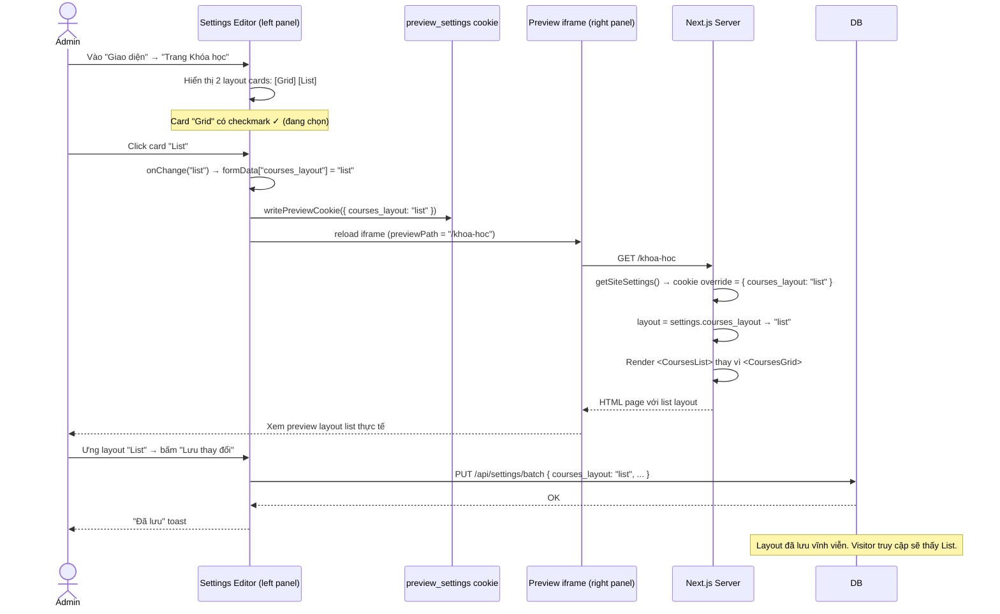

# Phân tích: Hệ thống Multi-Layout Visual Skeleton cho Site Settings

**Date:** 09/08/2026
**Scope:** Kiến trúc, tính khả thi, cơ chế preview, animation skeleton

---

## 1. Hiểu đúng yêu cầu

Admin vào `/quan-tri-vien/cai-dat` → tab "Trang chủ" / "Trang Khóa học" → thấy các **layout skeleton preview** (visual) → chọn 1 layout → **preview iframe bên phải live update** hiển thị trang thật với layout mới → **lưu** → website production đổi layout.

Yêu cầu skeleton:
- **1:1 realistic** — gần giống trang thật nhất có thể
- **Có animation** nếu layout có animation (carousel chạy ngang, cards stagger...)
- Admin nhìn skeleton là hiểu "nếu chọn cái này, web mình sẽ trông như này"

---

## 2. Cơ chế hiện tại (đã có sẵn)

### 2.1 PageBuilder Section Skeleton (pattern tham khảo)

```
SectionSkeletonPreview.tsx (868 dòng)
├── 14 section types, mỗi type = 1 SVG skeleton
├── SVG viewBox="0 0 240 120" cố định
├── Dùng `currentColor` + opacity để match theme
├── Các skeleton đều TĨNH (không animation)
│
└── Cách dùng:
    PageBuilder.tsx → catalog grid → mỗi item hiển thị:
    [SectionSkeletonPreview]
    [Tên section]
```

### 2.2 Settings Page (hiện tại)

```
/quan-tri-vien/cai-dat/page.tsx (1073 dòng)
├── Bên trái: editor (form fields cho từng section)
├── Bên phải: preview iframe (full-width)
├── PREVIEW_PAGES dropdown: chọn trang để preview
├── Cookie mechanism: preview_settings → override getSiteSettings()
│
└── Layout hiện tại: 520px editor + 1fr iframe, fill viewport
```

### 2.3 Preview Cookie Flow

```
Admin thay đổi field "hero_video_type"
↓
writePreviewCookie(changed) → document.cookie = "preview_settings={...}"
↓
iframe reload (/ hoặc /khoa-hoc)
↓
getSiteSettings() → getPreviewOverrides() → merge cookie overrides
↓
Page renders với giá trị mới từ cookie
```

---

## 3. Kiến trúc đề xuất

### 3.1 Layout Variants định nghĩa

Mỗi trang có 2-3 layout variants:

```
Trang /khoa-hoc:
├── "grid"     — Grid 3 cột cards (layout hiện tại)
├── "list"     — List dọc từng course, full-width card
└── "carousel" — Carousel ngang scroll-snap

Trang /san-pham:
├── "stacked"  — Left-right xen kẽ (layout hiện tại)
├── "masonry"  — Masonry grid không đều
└── "film"     — Hero video full-width + timeline dọc

Trang /cong-cu:
├── "grid"     — Grid 3 cột (layout hiện tại)
├── "featured" — 1 sản phẩm hero to + grid nhỏ bên dưới
```

### 3.2 File Structure

```
apps/web/src/
├── app/(nguoi-dung)/
│   ├── khoa-hoc/
│   │   ├── page.tsx              ← switch(layout) → render variant
│   │   └── _layouts/
│   │       ├── grid.tsx          ← layout hiện tại
│   │       └── list.tsx          ← mới
│   │
│   └── page.tsx                  ← switch(layout) → render variant
│       └── _layouts/
│           ├── homepage-default.tsx
│           └── homepage-compact.tsx
│
├── components/admin/
│   └── layout-selector/
│       ├── LayoutSelector.tsx     ← component chọn layout với skeleton
│       ├── LayoutSkeleton.tsx     ← skeleton preview cho từng layout variant
│       └── skeletons/             ← file skeleton SVG/CSS cho từng layout
│           ├── courses-grid.tsx
│           ├── courses-list.tsx
│           ├── portfolio-stacked.tsx
│           └── ...
```

### 3.3 Page Switch Mechanism

```typescript
// khoa-hoc/page.tsx
import { CoursesGrid } from "./_layouts/grid";
import { CoursesList } from "./_layouts/list";

const LAYOUT_MAP = {
  grid: CoursesGrid,
  list: CoursesList,
};

export default async function CoursesPage() {
  const [courses, faqs, settings] = await Promise.all([...]);
  const layout = (settings.courses_layout || "grid") as keyof typeof LAYOUT_MAP;
  const Layout = LAYOUT_MAP[layout] ?? CoursesGrid;
  
  return <Layout courses={courses} faqs={faqs} settings={settings} />;
}
```

### 3.4 Skeleton Preview — Visual 1:1

**Mức 1: SVG Skeleton (giống PageBuilder, tĩnh)**

```tsx
// LayoutSkeleton.tsx
const SKELETONS: Record<string, ReactElement> = {
  "courses-grid": (
    <svg viewBox="0 0 360 240">
      {/* Hero bar */}
      <rect y="0" width="360" height="40" rx="4" fill="currentColor" opacity="0.08" />
      {/* Grid 3 cột */}
      {[0,1,2].map(i => (
        <g key={i}>
          <rect x={8 + i*116} y="48" width="108" height="60" rx="4" fill="currentColor" opacity="0.06" />
          <rect x={12 + i*116} y="114" width="80" height="6" rx="2" fill="currentColor" opacity="0.12" />
          <rect x={12 + i*116} y="124" width="60" height="4" rx="1" fill="currentColor" opacity="0.06" />
        </g>
      ))}
    </svg>
  ),
  
  "courses-list": (
    <svg viewBox="0 0 360 240">
      <rect y="0" width="360" height="40" rx="4" fill="currentColor" opacity="0.08" />
      {/* List items */}
      {[0,1,2].map(i => (
        <g key={i}>
          <rect x="4" y={48 + i*60} width="80" height="52" rx="4" fill="currentColor" opacity="0.06" />
          <rect x="90" y={52 + i*60} width="180" height="8" rx="2" fill="currentColor" opacity="0.12" />
          <rect x="90" y={64 + i*60} width="120" height="4" rx="1" fill="currentColor" opacity="0.06" />
          <rect x="260" y={56 + i*60} width="80" height="28" rx="4" fill="currentColor" opacity="0.08" />
        </g>
      ))}
    </svg>
  ),
};
```

**Mức 2: CSS Animation Skeleton (có chuyển động)**

Cho carousel layout, skeleton thực sự chạy animation:

```tsx
"use client";

// Carousel skeleton với CSS animation chạy ngang
function CarouselSkeleton() {
  return (
    <div style={{ overflow: "hidden", width: "100%", height: 80 }}>
      <div style={{
        display: "flex",
        gap: 8,
        animation: "skeleton-carousel 4s ease-in-out infinite",
        width: "max-content",
      }}>
        {[0,1,2,3].map(i => (
          <div key={i} style={{
            width: 140, height: 80, borderRadius: 6,
            background: "var(--admin-surface-raised)",
          }}>
            <div style={{ height: 48, borderRadius: "4px 4px 0 0", background: "var(--admin-border)", opacity: 0.3 }} />
            <div style={{ padding: 6 }}>
              <div style={{ height: 6, width: "60%", borderRadius: 2, background: "var(--admin-text-secondary)", opacity: 0.15, marginBottom: 4 }} />
              <div style={{ height: 4, width: "40%", borderRadius: 1, background: "var(--admin-text-secondary)", opacity: 0.08 }} />
            </div>
          </div>
        ))}
      </div>
    </div>
  );
}
```

**Mức 3: Live Preview trong skeleton card (nặng nhất)**

Thay vì SVG, render chính component thật nhưng scale nhỏ trong 1 container:

```tsx
<div style={{ transform: "scale(0.3)", transformOrigin: "top left", width: "333%", pointerEvents: "none" }}>
  <CoursesList courses={sampleData} ... />
</div>
```

⚠️ Cách này nặng, render thật component → tốn bundle, phức tạp. Không khuyến nghị.

**Đề xuất: Mức 1 (SVG tĩnh) cho hầu hết layouts, Mức 2 (CSS animation) cho layouts có animation quan trọng (carousel, parallax).**

---

## 4. Integration vào Settings Page

### 4.1 Thêm section "Giao diện" vào field-defs.ts

```typescript
{
  id: "layout",
  title: "Giao diện",
  description: "Chọn cách bố trí và hiển thị nội dung cho từng trang.",
  previewPath: "/",
  fields: [],
  subSections: [
    {
      id: "layout-homepage",
      title: "Trang chủ",
      hint: "Chọn layout cho trang chủ",
      fields: [
        { key: "site_layout", label: "Layout", type: "layout-selector",
          options: [
            { label: "Mặc định", value: "default", skeleton: "homepage-default" },
            { label: "Tối giản", value: "compact", skeleton: "homepage-compact" },
          ]
        },
      ],
    },
    {
      id: "layout-courses",
      title: "Trang Khóa học",
      hint: "Chọn layout cho trang danh sách khóa học",
      fields: [
        { key: "courses_layout", label: "Layout", type: "layout-selector",
          options: [
            { label: "Dạng lưới", value: "grid", skeleton: "courses-grid" },
            { label: "Dạng danh sách", value: "list", skeleton: "courses-list" },
          ]
        },
      ],
    },
    // ... portfolio, presets, contact
  ]
}
```

### 4.2 Layout Selector Component

```tsx
// LayoutSelector.tsx
"use client";

interface LayoutOption {
  label: string;
  value: string;
  skeleton: string;
}

export function LayoutSelector({
  options,
  value,
  onChange,
}: {
  options: LayoutOption[];
  value: string;
  onChange: (v: string) => void;
}) {
  return (
    <div className="layout-selector-grid">
      {options.map((opt) => (
        <button
          key={opt.value}
          className={`layout-card ${value === opt.value ? "layout-card--active" : ""}`}
          onClick={() => onChange(opt.value)}
        >
          <LayoutSkeleton name={opt.skeleton} />
          <span className="layout-label">{opt.label}</span>
          {value === opt.value && <span className="layout-check">✓ Đang chọn</span>}
        </button>
      ))}
    </div>
  );
}
```

### 4.3 Preview Flow với Layout Selector



---

## 5. Feasibility Assessment

### Đã có sẵn (0 effort)

| Cơ chế | File | Status |
|--------|------|--------|
| site_settings key-value DB | schema.ts, routes/settings.ts | ✅ Hoạt động |
| Preview cookie | cai-dat/page.tsx (writePreviewCookie) | ✅ Hoạt động |
| Preview iframe | cai-dat/page.tsx (iframe) | ✅ Hoạt động |
| Preview overrides trong SSR | settings.ts (getPreviewOverrides) | ✅ Hoạt động |
| Pattern skeleton SVG | SectionSkeletonPreview.tsx | ✅ Pattern có sẵn |
| Layout page.tsx fetch API | page.tsx (hàm async Server Component) | ✅ Pattern có sẵn |

### Cần làm mới

| Task | Effort | Mô tả |
|------|--------|-------|
| 1. Định nghĩa layout variants | THẤP | Cho mỗi trang: 2-3 layout options |
| 2. Code layout variant components | TRUNG BÌNH | Mỗi variant là 1 component (dùng lại section components) |
| 3. Skeleton SVGs cho mỗi layout | THẤP | Giống SectionSkeletonPreview, SVG viewBox cố định |
| 4. LayoutSelector component | THẤP | Grid cards + SVG skeleton + active state |
| 5. Thêm field vào field-defs.ts | THẤP | `type: "layout-selector"`, key + options |
| 6. Render LayoutSelector trong cai-dat/page.tsx | THẤP | Thêm case trong renderField |
| 7. Switch case trong page.tsx | THẤP | Đọc settings.xxx_layout → render variant |

**Tổng effort: 1-2 ngày cho tất cả các trang.**

---

## 6. Skeleton Animation Assessment

### Có animation skeleton không?

| Layout pattern | Skeleton animation | Cách làm |
|----------------|-------------------|----------|
| Grid cards (tĩnh) | Không cần | SVG tĩnh |
| List (tĩnh) | Không cần | SVG tĩnh |
| Carousel | **Nên có** | CSS `@keyframes` chạy ngang cards |
| Stagger reveal | **Nên có** | CSS `animation-delay` cascade |
| Masonry grid | Không cần | SVG tĩnh |
| Video background | **Nên có** | CSS gradient pulse animation |

**Quyết định:** Animation skeleton dùng CSS animation đơn giản (keyframes), embed trực tiếp trong component. Không dùng GSAP/Framer Motion cho skeleton (quá nặng cho preview). Chỉ cần hiển thị "chuyển động như nào" — CSS animation đủ thể hiện ý tưởng.

### Ví dụ: Carousel skeleton animation

```css
@keyframes skeleton-carousel {
  0%, 100% { transform: translateX(0); }
  40% { transform: translateX(-160px); }
  60% { transform: translateX(-160px); }
}
```

### Animation trong preview iframe

Preview iframe render **trang thật** (không phải skeleton). Nếu layout đã có GSAP animation trong code → preview sẽ có animation thật. Skeleton chỉ để chọn layout.

---

## 7. Câu hỏi mở

1. **Layout variants cho trang nào trước?** Homepage → Khoá học → Dự án → Công cụ?
2. **Mỗi trang bao nhiêu variants?** 2 (đơn giản) hay 3 (đa dạng)?
3. **Animation skeleton có thực sự cần không?** Hay SVG tĩnh 1:1 là đủ? (SVG tĩnh + 1:1 layout đã truyền tải ~80% ý tưởng)
4. **Mỗi layout variant = components riêng hay config JSON?** Components riêng an toàn hơn, type-safe hơn, dễ maintain hơn JSON config phức tạp.

---

## Kết luận

**Hoàn toàn khả thi.** 90% cơ chế đã có sẵn (settings, preview cookie, iframe, PageBuilder skeleton pattern). Chỉ cần:

1. Code 2-3 layout variant components cho mỗi trang (dùng lại section components hiện có)
2. Vẽ 2-3 SVG skeleton 1:1 cho mỗi variant
3. Thêm LayoutSelector vào cài đặt
4. Switch case trong page.tsx

Thời gian triển khai: ~1-2 ngày cho homepage + khoa-hoc + san-pham + cong-cu.

Muốn làm không?
