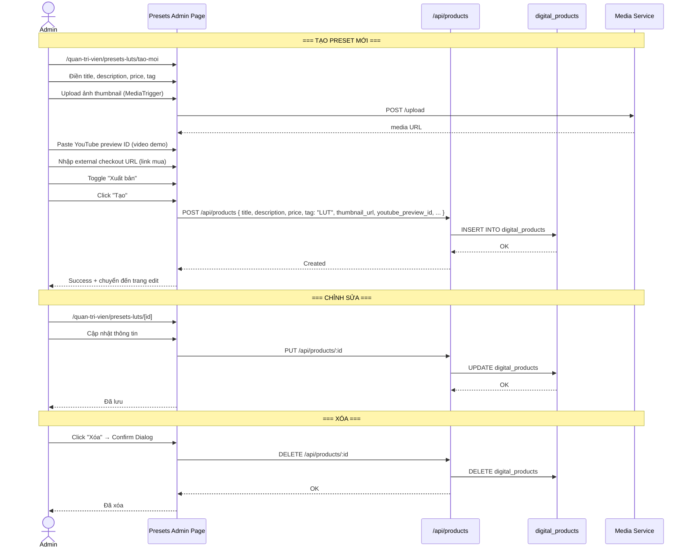
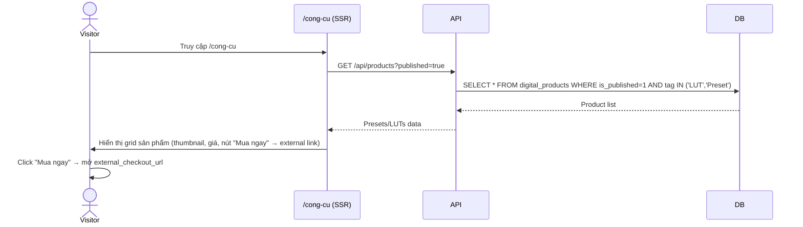
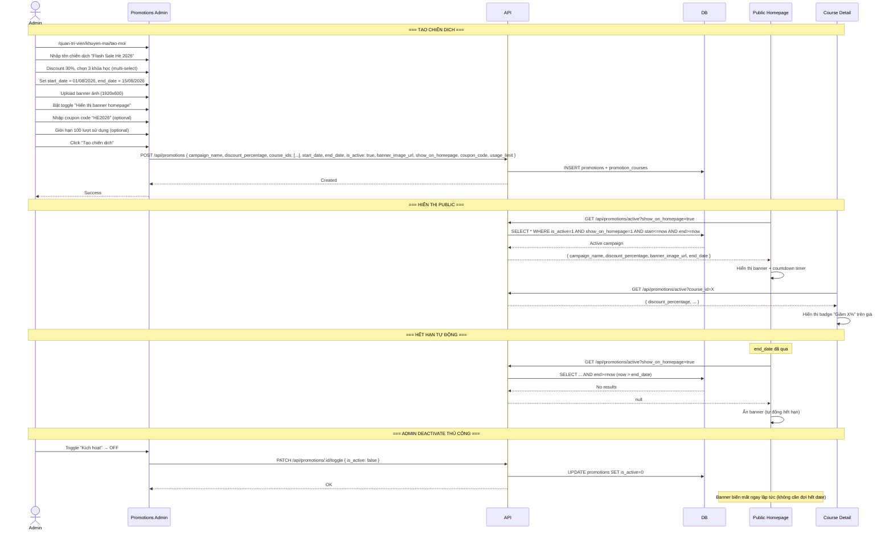
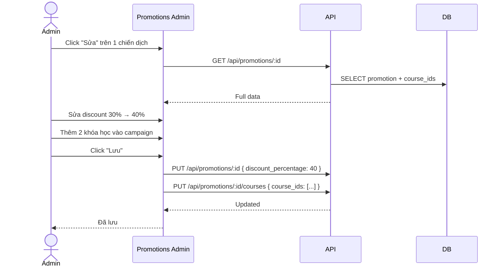
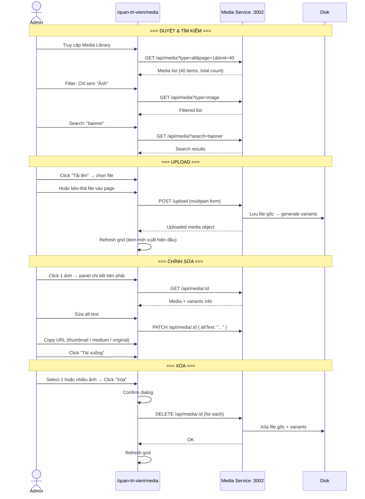
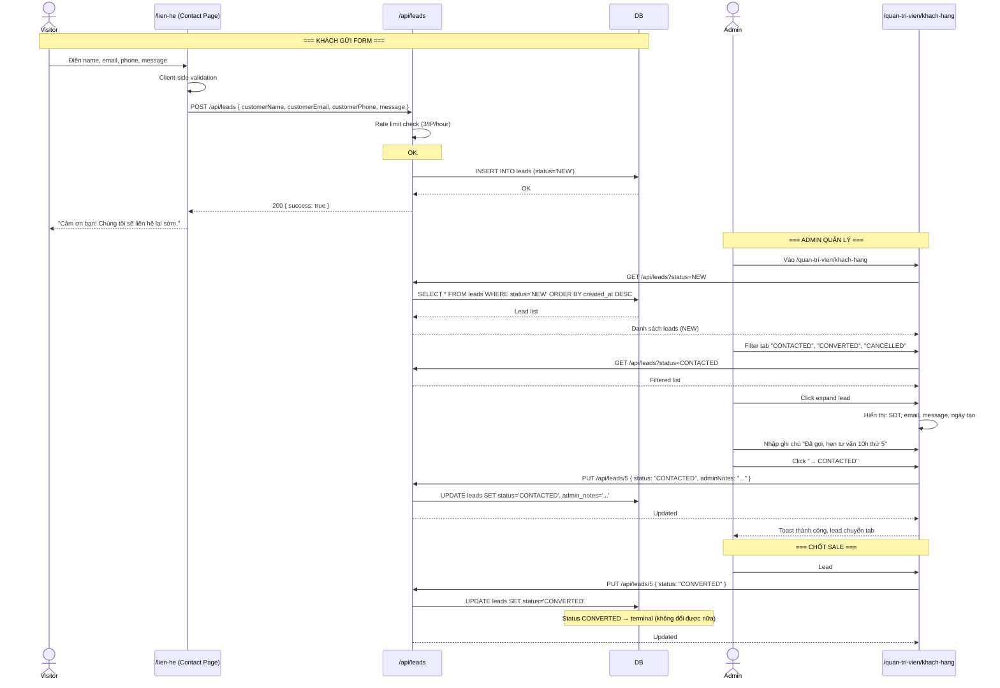
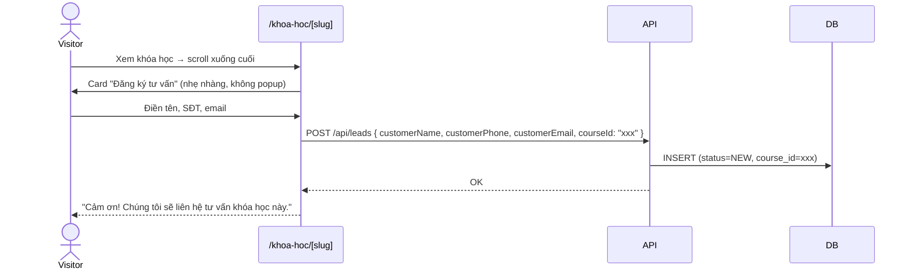

# Brainstorming Session: 4 Admin Modules Redesign

**Date:** 09/08/2026
**Techniques:** Classic Brainstorm → SCAMPER → Affinity Mapping → Multi-Perspective
**Ref Docs:** `.docs/brd/06`, `.docs/brd/07`, `.docs/brd/08`

---

## Problem Statements

| # | Module | Problem (1 sentence) |
|---|--------|---------------------|
| 1 | Presets & LUTs | Admin cần CRUD preset/LUT entries để hiển thị ra public page `/cong-cu`, nhưng hiện tại PageBuilder không hoạt động và dùng sai công cụ |
| 2 | Khuyến mãi | Admin cần tạo chiến dịch khuyến mãi đầy đủ (banner, thời gian, đa khóa học, hiển thị homepage), nhưng frontend đang gửi sai field |
| 3 | Media | Backend media microservice hoàn chỉnh nhưng admin UI chỉ là stub rỗng |
| 4 | Leads | Module đang hoạt động nhưng cần làm rõ nghiệp vụ và nâng cấp |

---

## Module 1: Presets & LUTs

### Current State

```
┌─────────────────────────────────────────────────────────────────┐
│  HIỆN TẠI                                                       │
│                                                                  │
│  Admin: /quan-tri-vien/presets-luts → PageBuilder (trống rỗng) │
│  Public: /cong-cu → SectionRenderer (fetch presets_page sections)│
│                                                                  │
│  BLOCKER #1: ENTITY_SECTION_MAP.presets_page = []               │
│  BLOCKER #2: URL mismatch PageBuilder vs backend routes          │
│  BLOCKER #3: Section types chưa được define                     │
│                                                                  │
│  DB: digital_products table ĐÃ CÓ SẴN                           │
│  - tag = "LUT" / "Preset" để phân loại                          │
│  - thumbnail_url, price, description, external_checkout_url     │
│  - youtube_preview_id (video demo)                              │
└─────────────────────────────────────────────────────────────────┘
```

### Proposed Solution: Pattern `du-an`

Giữ nguyên pattern đã thành công của `du-an` (danh sách + tạo mới + chỉnh sửa). Không dùng PageBuilder cho mục đích này.

#### Admin Flow



#### Public Page Flow (`/cong-cu`)



**Note:** Có thể lọc theo tag trên frontend hoặc thêm query param `?tag=LUT` vào API.

#### Data Model (dùng lại `digital_products`)

| Field | Type | Dùng cho |
|-------|------|----------|
| title | string | Tên preset/LUT |
| description | text | Mô tả (bao gồm trước/sau, tương thích phần mềm) |
| price | integer | Giá VND |
| thumbnail_url | string | Ảnh preview (qua media service) |
| youtube_preview_id | string | Video demo YouTube |
| external_checkout_url | string | Link mua (Gumroad, Shopee, etc.) |
| tag | string | "LUT" hoặc "Preset" |
| is_published | boolean | Có hiển thị public không |
| is_featured_on_home | boolean | Nổi bật trang chủ |

#### Cần làm

| # | Task | Effort |
|---|------|--------|
| 1.1 | Tạo `/quan-tri-vien/presets-luts/tao-moi/page.tsx` (giống du-an/tao-moi) | Medium |
| 1.2 | Tạo `/quan-tri-vien/presets-luts/[id]/page.tsx` (edit) | Medium |
| 1.3 | Refactor `/quan-tri-vien/presets-luts/page.tsx`: list view (grid/table, filter tag, publish toggle) | Medium |
| 1.4 | Sửa `/cong-cu/page.tsx`: thay vì SectionRenderer, fetch products + hiển thị grid | Medium |
| 1.5 | Xóa route `/api/presets-page` (không cần nữa) | Low |
| 1.6 | (Optional) Thêm `product_showcases` UI: ảnh trước/sau cho mỗi preset | Low |

---

## Module 2: Chương trình Khuyến mãi

### Current State

```
┌───────────────────────────────────────────────────────────────┐
│  BACKEND: hoàn chỉnh                                          │
│  - CRUD promotions + M2M courses + toggle + date validation   │
│  - Zod schema: course_ids (mảng), discount %, dates          │
│                                                               │
│  FRONTEND: bug                                               │
│  - Gửi courseId (số ít) → backend yêu cầu course_ids (mảng)  │
│  - Form chỉ có single-select dropdown                        │
│  - Không có edit, toggle, course assignment riêng             │
│                                                               │
│  DB THIẾU:                                                   │
│  - banner_image_url (ảnh banner chiến dịch)                   │
│  - show_on_homepage (hiển thị banner ra homepage)             │
│  - coupon_code (mã giảm giá - optional)                      │
│  - usage_limit (giới hạn số lần dùng - optional)             │
└───────────────────────────────────────────────────────────────┘
```

### Proposed Solution: Nâng cao

#### Chiến dịch Khuyến mãi Lifecycle



#### Admin Edit Flow



#### Data Model Changes

**Thêm vào bảng `promotions`:**

```sql
ALTER TABLE promotions ADD COLUMN banner_image_url TEXT;
ALTER TABLE promotions ADD COLUMN show_on_homepage INTEGER DEFAULT 0;
ALTER TABLE promotions ADD COLUMN coupon_code TEXT;
ALTER TABLE promotions ADD COLUMN usage_limit INTEGER;
```

#### API Changes

**Cần thêm endpoint:**
- `GET /api/promotions/active?show_on_homepage=true` — lấy campaign đang active có banner homepage
- Update `POST /api/promotions` Zod schema — thêm `banner_image_url`, `show_on_homepage`, `coupon_code`, `usage_limit`

#### Homepage Integration

```tsx
// Thêm vào page.tsx homepage:
// <PromotionBanner /> — component gọi GET /api/promotions/active?show_on_homepage=true
// Nếu có campaign active → hiển thị banner + countdown timer
```

#### Cần làm

| # | Task | Effort |
|---|------|--------|
| 2.1 | Migration: thêm 4 cột vào bảng promotions | Low |
| 2.2 | Update Zod schema + backend routes | Low |
| 2.3 | Build admin form: tạo/sửa chiến dịch (multi-select course, upload banner, date picker, homepage toggle, coupon) | High |
| 2.4 | Build admin list view (grid/table, filter active/expired, toggle, delete) | Medium |
| 2.5 | Build `PromotionBanner` homepage component (banner + countdown timer GSAP) | Medium |
| 2.6 | Hiển thị badge giảm giá trên course card + course detail | Low |

---

## Module 3: Thư viện Ảnh & Video

### Current State

```
┌──────────────────────────────────────────────────────────────────┐
│  BACKEND (Media Microservice - port 3002): HOÀN CHỈNH           │
│                                                                  │
│  Upload Pipeline:                                                │
│    File → validate → Sharp resize (max1920px) → webp convert    │
│    → LQIP blur → store to disk → generate 4 variants → save DB  │
│                                                                  │
│  Routes:                                                         │
│    POST   /upload          - Upload file (admin)                │
│    GET    /img/:id         - Serve image (dynamic resize ?w=)   │
│    GET    /img/:id/:variant - Serve variant                      │
│    GET    /raw/*           - Raw file serving                    │
│    GET    /api/media       - List media (paginated, filter)     │
│    GET    /api/media/:id   - Get single + variants               │
│    PATCH  /api/media/:id   - Update altText                      │
│    DELETE /api/media/:id   - Delete file + variants              │
│    POST   /external        - Register YouTube/external URL       │
│                                                                  │
│  Variants: micro(16px), thumbnail(400px), medium(800px),        │
│            large(1400px), og(1200x630)                          │
│                                                                  │
│  FRONTEND (MediaManager component): ĐÃ BUILD SẴN                │
│  - components/admin/media-manager/index.tsx (336 dòng)          │
│  - Modal overlay + grid + filter tabs + search + pagination     │
│  - Upload button + preview bar + delete confirm                 │
│  - Multi-select mode                                            │
│  - MediaTrigger (nút "Chọn từ thư viện" dùng trong form)       │
│                                                                  │
│  Admin Page: STUB RỖNG (45 dòng, disabled input, placeholder)   │
└──────────────────────────────────────────────────────────────────┘
```

### Proposed Solution: Tận dụng MediaManager + mở rộng full-page

#### Architecture

Hiện tại `MediaManager` là **modal component** (overlay). Nó cần được linh hoạt:
- Trong form (du-an, presets, khuyen-mai): **modal** → `MediaTrigger` mở modal lên
- Trong `/quan-tri-vien/media`: **full-page** → embed trực tiếp, không overlay

#### Full-Page Media Admin Flow



#### Features nâng cao

| Feature | Mô tả |
|---------|-------|
| Drag-and-drop upload | Kéo file từ desktop vào page → tự động upload |
| Paste từ clipboard | Ctrl+V paste ảnh đã copy → upload |
| Bulk select + delete | Checkbox chọn nhiều → xóa hàng loạt |
| Copy URL | Click vào ảnh → panel bên phải → copy URL variant (thumbnail/medium/large/original) |
| Sort | Sắp xếp theo: mới nhất, tên, dung lượng |
| Upload folder | Hỗ trợ upload nguyên folder ảnh |
| Progress bar | Hiển thị tiến trình upload từng file |
| Alt text inline edit | Double-click tên file → edit inline |
| YouTube registration | Form nhỏ: paste YouTube URL → tự động lấy thumbnail + lưu vào media |

#### Cần làm

| # | Task | Effort |
|---|------|--------|
| 3.1 | Refactor MediaManager để hỗ trợ full-page mode (không overlay) | Medium |
| 3.2 | Build `/quan-tri-vien/media/page.tsx` với full-page MediaManager | High |
| 3.3 | Thêm drag-and-drop upload zone | Medium |
| 3.4 | Thêm paste-from-clipboard upload | Low |
| 3.5 | Thêm bulk select + bulk delete | Medium |
| 3.6 | Thêm panel chi tiết bên phải (alt text, variants, copy URL) | Medium |
| 3.7 | Thêm sort options | Low |
| 3.8 | CSS responsive, grid masonry tối ưu | Medium |

---

## Module 4: Khách hàng Tiềm năng (Leads)

### Current Flow



### Các nguồn Leads trong dự án này

Dựa trên phân tích codebase và BRD:

```
                           ┌─────────────────────┐
                           │   NGUỒN LEADS       │
                           └─────────┬───────────┘
                                     │
          ┌──────────────────────────┼──────────────────────────┐
          │                          │                          │
          ▼                          ▼                          ▼
┌──────────────────┐    ┌──────────────────┐    ┌──────────────────┐
│  TRANG LIÊN HỆ   │    │  TRANG KHÓA HỌC   │    │  KHÁC (MANUAL)   │
│  (/lien-he)      │    │  (/khoa-hoc/[slug])│    │                  │
├──────────────────┤    ├──────────────────┤    ├──────────────────┤
│ Form chung:      │    │ Form đăng ký      │    │ Admin nhập tay:  │
│ - Tên            │    │ tư vấn khóa học   │    │ - Facebook Ads   │
│ - Email          │    │ - Tên             │    │ - Zalo message   │
│ - SĐT            │    │ - SĐT             │    │ - YouTube comment│
│ - Lời nhắn       │    │ - Email           │    │ - Điện thoại gọi │
│                  │    │ - Gắn courseId    │    │   đến            │
│ status: NEW      │    │ status: NEW       │    │ status: NEW      │
│ courseId: NULL   │    │ courseId: X       │    │ courseId: manual │
└──────────────────┘    └──────────────────┘    └──────────────────┘
          │                          │                          │
          └──────────────────────────┼──────────────────────────┘
                                     │
                                     ▼
                          ┌──────────────────┐
                          │   LEADS TABLE     │
                          │   (SQLite)        │
                          └──────────────────┘
                                     │
                                     ▼
                          ┌──────────────────┐
                          │  ADMIN XỬ LÝ     │
                          │  /quan-tri-vien/ │
                          │  khach-hang      │
                          └──────────────────┘
```

**Hiện tại đã có:**
- ✅ `/lien-he` → form submit contact (hoạt động)
- ✅ Backend rate-limit 3/IP/hour
- ✅ Admin filter 4 tabs status
- ✅ Admin expand + ghi chú + đổi status

**Hiện tại CHƯA có:**
- ❌ Form đăng ký trên trang khóa học (gắn courseId)
- ❌ Admin nhập tay lead
- ❌ Search leads theo tên/SĐT
- ❌ Export CSV
- ❌ Click-to-call SĐT
- ❌ Hiển thị course name (khi lead có courseId)

### Proposed Improvements

| Priority | Feature | Mô tả | Effort |
|----------|---------|-------|--------|
| P0 | Search leads | Tìm theo tên, SĐT, email trong admin list | Low |
| P0 | Hiển thị course name | Khi lead có courseId → hiển thị tên khóa học | Low |
| P1 | Form đăng ký trên course detail | Thêm form "Đăng ký tư vấn" ở cuối course detail, tự động gắn courseId | Medium |
| P1 | Export CSV | Nút "Xuất CSV" → download danh sách lead đang filter | Low |
| P2 | Click-to-call | SĐT clickable → `tel:` link để gọi ngay | Low |
| P2 | Admin nhập tay lead | Nút "Thêm lead" → form nhỏ: tên, SĐT, chọn khóa học | Medium |
| P2 | Dashboard stats | Conversion rate: NEW → CONTACTED → CONVERTED | Medium |
| P3 | Pagination | Khi có nhiều leads, cần phân trang | Medium |

### Flow nâng cao: Lead từ Course Detail



---

## Tổng hợp: Độ ưu tiên triển khai

### Phase 1: Quick Wins (Low effort, high impact)

| # | Module | Task | Effort |
|---|--------|------|--------|
| W1 | Promotions | Fix bug `courseId` → `course_ids` + build proper form | High |
| W2 | Media | Build full-page `/quan-tri-vien/media` (embed MediaManager) | High |
| W3 | Leads | Search + course name display | Low |

### Phase 2: Core Value

| # | Module | Task | Effort |
|---|--------|------|--------|
| C1 | Presets | CRUD admin (list + create + edit) | High |
| C2 | Presets | Public page `/cong-cu` rewrite | Medium |
| C3 | Promotions | Migration + backend update (banner, homepage toggle) | Medium |
| C4 | Promotions | `PromotionBanner` homepage component | Medium |
| C5 | Leads | Form đăng ký trên course detail + courseId tracking | Medium |

### Phase 3: Polish

| # | Module | Task | Effort |
|---|--------|------|--------|
| P1 | Media | Drag-drop upload, paste-from-clipboard, bulk delete | Medium |
| P2 | Leads | Export CSV, click-to-call, manual lead entry | Medium |
| P3 | Promotions | Coupon code validation, usage limit tracking | Medium |
| P4 | Presets | Before/after image showcase (product_showcases) | Low |

---

## Open Questions

1. **Presets:** Tag nào dùng? "LUT" và "Preset" riêng biệt hay gộp chung? Có cần phân biệt LUT video vs Preset ảnh?
2. **Promotions:** Coupon code có cần validate khi khách nhập ở checkout không? Checkout là external (Gumroad) hay internal?
3. **Media:** Có cần hỗ trợ upload video không? Hay video luôn từ YouTube embed?
4. **Leads:** Có cần tích hợp gửi email tự động cho khách sau khi submit form (autoresponder)?
5. **Leads:** Cần notification (email/slack) cho admin khi có lead mới không?

---

## Next Steps

1. Confirm open questions ↑
2. Tạo BDD specs cho từng module → `/bdd-spec`
3. Triển khai theo Phase 1 → Phase 2 → Phase 3
