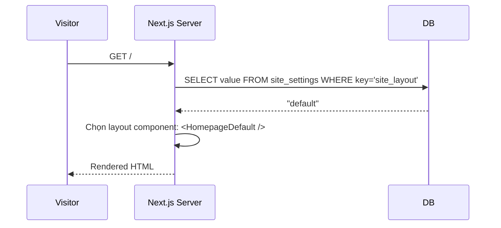
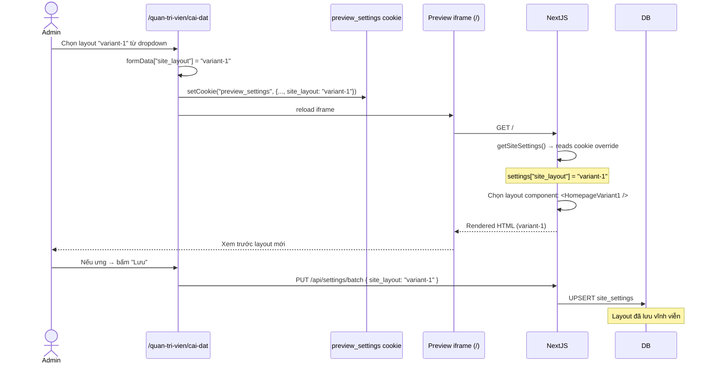

# Brainstorming Session: Multi-Layout Site Config

**Date:** 09/08/2026
**Technique:** Classic Brainstorm → Feasibility Matrix

---

## Phase 1: Frame the Problem

**Problem statement:** Admin muốn vào `/quan-tri-vien/cai-dat`, chọn 1 layout template cho website, preview ngay, và website đổi layout tức thì.

**Why?**
1. Vì admin không phải developer, không sửa code được
2. Vì cùng 1 data (khóa học, dự án, sản phẩm) nhưng muốn thay đổi cách trình bày
3. Vì muốn A/B test hoặc đổi phong cách theo mùa/chiến dịch

**Success:** Admin chọn layout từ dropdown → preview iframe cập nhật ngay → Save → Website đổi layout cho tất cả visitor.

---

## Phase 2: Kiến trúc — Có khả thi không?

### Cơ chế đã có sẵn trong dự án

```
┌─────────────────────────────────────────────────────────────┐
│                    HIỆN CÓ (đã hoạt động)                    │
├─────────────────────────────────────────────────────────────┤
│                                                             │
│  site_settings table (key-value)                            │
│      ↓                                                      │
│  getSiteSettings() Server Component                         │
│      ↓                                                      │
│  settings["hero_video_type"] → "youtube"                    │
│  settings["home_work_heading"] → "Dự án nổi bật"            │
│      ↓                                                      │
│  Component renders based on settings values                 │
│                                                             │
│  PREVIEW:                                                   │
│  Admin edit form → cookie "preview_settings"                │
│      ↓                                                      │
│  getPreviewOverrides() overrides settings                   │
│      ↓                                                      │
│  Preview iframe reloads with overridden settings            │
│                                                             │
└─────────────────────────────────────────────────────────────┘
```

Thêm layout selector chỉ cần **1 key mới** `site_layout`:

```
site_layout = "default" | "variant-1" | "variant-2" | "minimal" | "bold"
```

### SSR Flow (production)



### Preview Flow (admin)



---

## Phase 3: Các cách triển khai

### Option A: Component Switch (Recommended)

```tsx
// page.tsx
export default async function Homepage() {
  const settings = await getSiteSettings();
  const layout = settings.site_layout || "default";

  switch (layout) {
    case "variant-1": return <HomepageVariant1 settings={settings} />;
    case "minimal": return <HomepageMinimal settings={settings} />;
    default: return <HomepageDefault settings={settings} />;
  }
}
```

| Pros | Cons |
|------|------|
| Đơn giản, type-safe | Mỗi layout = 1 file component mới |
| Tối ưu SSR, tree-shaking | Layout phải được code trước, không thể tự tạo |
| Reuse section components giữa các layout | Thêm layout mới cần developer |

### Option B: Section Order Config (JSON-based)

```json
// site_settings key "homepage_sections"
[
  { "type": "hero_banner", "config": {...} },
  { "type": "promotion_banner", "config": {...} },
  { "type": "work_section", "config": {...} }
]
```

Mỗi layout là 1 array section khác nhau → render bằng SectionRenderer.

| Pros | Cons |
|------|------|
| Admin tự sắp xếp section | Phức tạp để build UI drag-drop |
| Không cần code mới | Mỗi section cần nhận config từ JSON |
| | Khó validate, dễ lỗi |

### Option C: CSS Themes (Visual only)

Chỉ đổi CSS variables (màu, font, spacing) — không đổi cấu trúc.

```css
[data-theme="default"] { --clr-primary: #ff005a; --clr-bg: #000; }
[data-theme="light"] { --clr-primary: #0066ff; --clr-bg: #fff; }
```

| Pros | Cons |
|------|------|
| Cực kỳ đơn giản | Chỉ đổi màu, không đổi bố cục |
| Không cần code component mới | Không giải quyết được "đổi layout" |

---

## Phase 4: Đề xuất — Hybrid (A + C)

### Cho homepage: 2-3 layout templates

| Layout ID | Tên | Mô tả |
|-----------|-----|-------|
| `default` | Mặc định | Hero → PromotionBanner → Work → Products → Counter → About (layout hiện tại, sections xếp dọc) |
| `compact` | Tối giản | Hero → Products (bento grid) → About (rút gọn, bỏ Work & Counter) |
| `cinematic` | Điện ảnh | Hero full-screen + video background → Work (carousel ảnh) → Products (cards overlay) → Counter (parallax) → About |

Mỗi layout là 1 file trong `app/(nguoi-dung)/_layouts/`:

```
app/(nguoi-dung)/
├── _layouts/
│   ├── homepage-default.tsx    ← layout hiện tại
│   ├── homepage-compact.tsx    ← mới
│   └── homepage-cinematic.tsx  ← mới
└── page.tsx                    ← switch dựa trên settings.site_layout
```

### Cho các trang khác: 1-2 variants

| Page | Layouts |
|------|---------|
| `/khoa-hoc` | `default` (grid cards) / `list` (list view) |
| `/san-pham` | `default` (left/right) / `masonry` (masonry grid) |
| `/cong-cu` | `default` (3-col grid) / `featured` (hero + cards) |

### Cài đặt admin

Thêm vào `field-defs.ts` section `homepage`:

```typescript
{
  id: "site-layout",
  title: "Giao diện",
  hint: "Chọn layout cho từng trang",
  fields: [
    { key: "site_layout", label: "Layout trang chủ", type: "select",
      options: [
        { label: "Mặc định", value: "default" },
        { label: "Tối giản", value: "compact" },
        { label: "Điện ảnh", value: "cinematic" },
      ]
    },
    { key: "courses_layout", label: "Layout trang Khóa học", type: "select",
      options: [
        { label: "Dạng lưới (mặc định)", value: "default" },
        { label: "Dạng danh sách", value: "list" },
      ]
    },
    // ... cho từng trang
  ]
}
```

---

## Phase 5: Feasibility Matrix

| Tiêu chí | Điểm | Ghi chú |
|----------|------|---------|
| **Khả thi kỹ thuật** | 10/10 | Chỉ cần thêm 1 key vào site_settings + switch case trong page.tsx |
| **Preview hoạt động** | 10/10 | Cookie `preview_settings` đã có sẵn, hoạt động ngay |
| **SSR compatible** | 10/10 | Server Component đọc settings, không cần localStorage |
| **Admin UX** | 8/10 | Thêm dropdown vào cài đặt, preview iframe update ngay |
| **Performance** | 9/10 | Static import hoặc dynamic import cho từng layout |
| **Maintainability** | 7/10 | Mỗi layout mới cần developer code, không tự tạo được |
| **Scalability** | 8/10 | Có thể thêm layout mới bất kỳ lúc nào |

### Kết luận: HOÀN TOÀN KHẢ THI

Cơ chế đã có sẵn 90% (site_settings, preview cookie, SSR). Chỉ cần:
1. Code 2-3 layout variants cho mỗi trang
2. Thêm select field vào `field-defs.ts` 
3. Switch case trong `page.tsx`

---

## Phase 6: Action Plan

### Step 1: Add layout keys to field-defs.ts
- `site_layout` → homepage layout selector
- `courses_layout` → courses page layout selector
- `portfolio_layout` → portfolio page layout selector

### Step 2: Code layout variants

**Homepage variants (ưu tiên cao nhất):**

| Layout | Cấu trúc sections |
|--------|-------------------|
| `default` | Hero → Promotion → Work (2 cards) → Products (bento) → Counter → About |
| `compact` | Hero → Products (bento) → About |
| `cinematic` | Hero (full-screen) → Work (carousel) → Products (overlay) → Counter → About |

**Course page variants:**

| Layout | Mô tả |
|--------|-------|
| `default` | Hero → Grid cards → Brand → FAQ |
| `list` | Hero → List view (vertical) → FAQ |

### Step 3: Implement switch in page.tsx

```tsx
import { HomepageCompact } from "./_layouts/homepage-compact";
import { HomepageCinematic } from "./_layouts/homepage-cinematic";
import { HomepageDefault } from "./_layouts/homepage-default";

export default async function Homepage() {
  const settings = await getSiteSettings();
  const layout = settings.site_layout || "default";
  
  const [portfolios, courses, products] = await Promise.all([...]);
  
  const props = { settings, portfolios, courses, products };
  
  switch (layout) {
    case "compact": return <HomepageCompact {...props} />;
    case "cinematic": return <HomepageCinematic {...props} />;
    default: return <HomepageDefault {...props} />;
  }
}
```

### Step 4: Preview verification
1. Admin vào cài đặt → chọn layout "compact" → preview iframe đổi ngay
2. Admin bấm Lưu → layout lưu vào DB
3. Visitor truy cập → SSR trả về layout mới

---

## Open Questions

1. **Bao nhiêu layout variants cho homepage?** 2 (default + compact) hay 3 (thêm cinematic)?
2. **Layout cho trang khóa học, dự án, công cụ có cần ngay không?** Hay chỉ làm homepage trước?
3. **Layout có ảnh hưởng đến mobile không?** Hay chỉ desktop?

---

## Next Steps

1. Confirm số lượng layout variants
2. Bắt đầu code layout variants (bắt đầu từ homepage)
3. Thêm field vào admin cài đặt
