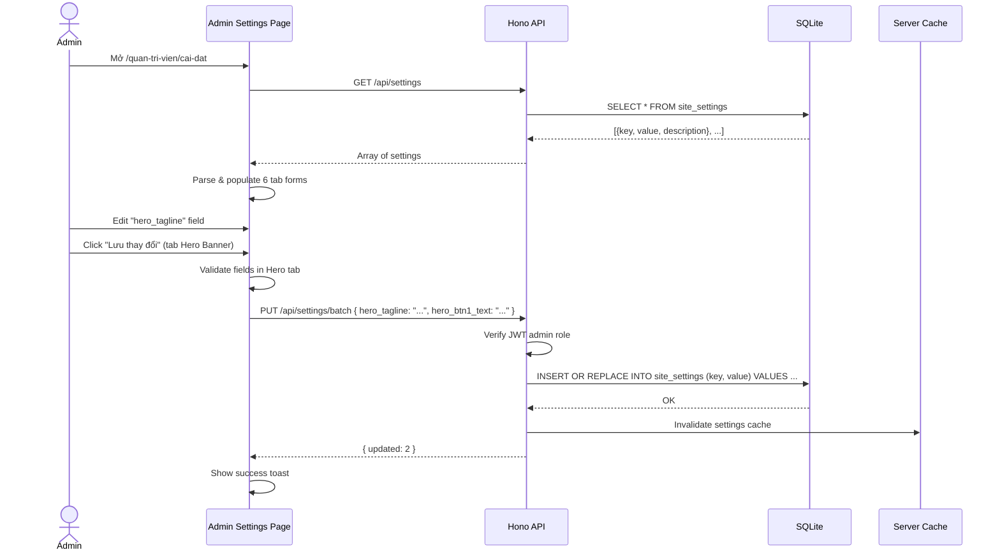
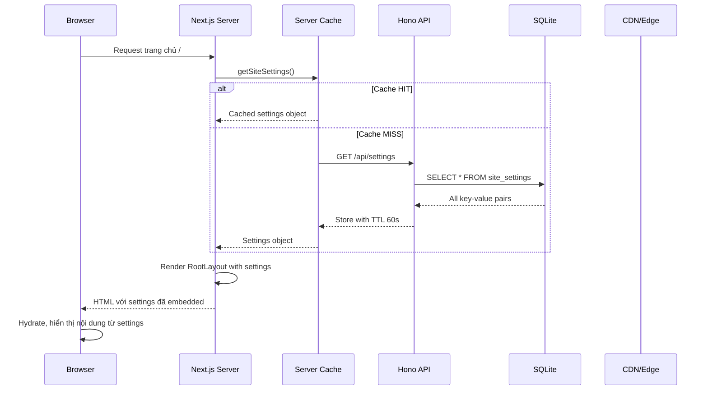
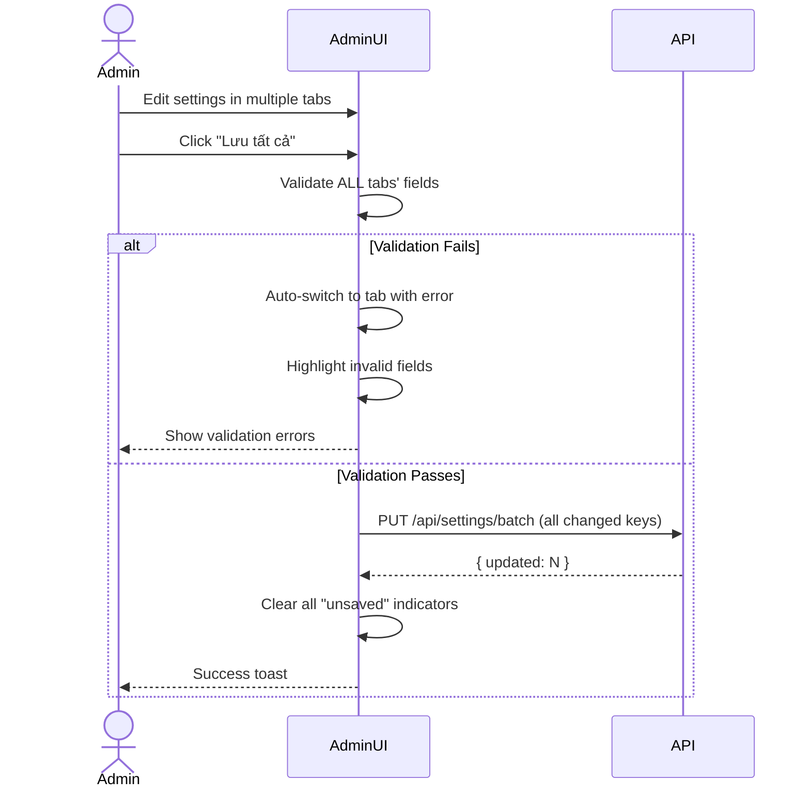

# BRD 01: Site Settings CMS

**Document Type:** Business Requirements Document  
**Module:** Site Settings CMS  
**Version:** 1.0  
**Date:** 2026-07-21  
**Owner:** Admin  
**Ref Spec:** `.docs/specs/01-site-settings-cms.md`  
**Ref Blueprint:** `DYNAMIC-CONVERSION-BLUEPRINT.md` Section 2.1  

---

## 1. Business Background (Bối cảnh nghiệp vụ)

Hiện tại toàn bộ website hiển thị nội dung tĩnh: tiêu đề site, tagline, navigation, text homepage, social links, contact info... đều được hardcode trong source code. Mỗi lần muốn thay đổi (VD: đổi số điện thoại, thêm link mạng xã hội mới, đổi text hero banner), admin phải sửa code và deploy lại. Điều này không khả thi với người không có kỹ năng lập trình, gây chậm trễ và phụ thuộc vào developer.

**Mục tiêu:** Cho phép Administrator thay đổi mọi text/link/brand trên website thông qua 1 giao diện Settings trực quan trong Admin Dashboard, không cần code, không cần deploy. Thay đổi có hiệu lực ngay lập tức trên website public.

---

## 2. Business Requirements (Yêu cầu nghiệp vụ)

| ID | Requirement | Priority | Rationale |
|----|------------|----------|-----------|
| BR-01.1 | Admin xem và chỉnh sửa tất cả cài đặt website từ 1 trang duy nhất, phân nhóm theo tab | Must Have | Giảm thời gian tìm kiếm, tránh bỏ sót |
| BR-01.2 | Mỗi nhóm setting có thể lưu độc lập (không cần lưu tất cả cùng lúc) | Must Have | Admin có thể chỉnh từng phần, không sợ mất dữ liệu chưa hoàn thiện |
| BR-01.3 | Website tự động hiển thị nội dung mới nhất từ settings (cache TTL 60s) | Must Have | Đảm bảo nội dung luôn cập nhật, không cần restart server |
| BR-01.4 | Các field phức tạp (nav items, social links, brand list) có UI editor trực quan, không phải paste JSON thô | Should Have | Giảm lỗi syntax JSON, tăng UX cho admin không technical |
| BR-01.5 | Hỗ trợ undo/reset về giá trị đã lưu gần nhất | Nice to Have | An toàn khi admin lỡ tay sửa sai |
| BR-01.6 | Media field (logo, favicon) tích hợp Media Library picker | Must Have | Nhất quán với hệ thống media, không phải paste URL thủ công |

---

## 3. Stakeholders & Actors

| Actor | Role | Concern |
|-------|------|---------|
| **Administrator** | Người duy nhất có quyền chỉnh sửa settings | Giao diện dễ dùng, thay đổi có hiệu lực ngay, không sợ sai |
| **Website Visitor** | Người xem website public | Luôn thấy nội dung mới nhất, website hiển thị nhất quán |
| **System** | Hệ thống tự động | Cache, validate, audit trail các thay đổi |

---

## 4. Business Rules

| ID | Rule | Enforcement |
|----|------|-------------|
| BR-R1 | Mỗi setting key là unique (TEXT PRIMARY KEY) | Database constraint |
| BR-R2 | Value dạng JSON (nav_items, social_links...) phải parse được thành JSON hợp lệ | Client-side validation trước submit |
| BR-R3 | Chỉ ADMIN role mới được PUT settings | Backend middleware check JWT role |
| BR-R4 | Cache settings TTL 60 giây, tự động invalidate sau PUT | Server-side cache logic |
| BR-R5 | Khi key chưa tồn tại, PUT sẽ INSERT mới (upsert) | SQLite INSERT OR REPLACE |
| BR-R6 | Settings không có giá trị → frontend dùng fallback có sẵn trong code | Component-level default props |
| BR-R7 | Không được xóa settings key (chỉ edit value) | Không có DELETE endpoint cho settings |

---

## 5. Input / Output Specification

### 5.1 Input: Admin Edit Settings

| Field Group | Sample Key | Data Type | Validation | UI Component |
|-------------|-----------|-----------|------------|--------------|
| **Site Identity** | `site_title` | string | 1-120 chars | Text input |
| | `site_description` | string | 1-300 chars | Textarea + char counter |
| | `site_keywords` | JSON array | max 10 items | Tag editor (add/remove tags) |
| | `site_url` | string | Valid URL format | URL input |
| | `theme_color` | string | Hex color `#XXXXXX` | Color picker |
| | `logo_url` | string | Media ID reference | Media Library picker |
| | `favicon_url` | string | Media ID reference | Media Library picker |
| **Navigation** | `nav_items` | JSON array | Mỗi item: `{label, href}` | Reorderable list editor |
| | `footer_nav` | JSON array | Mỗi item: `{label, href}` | Reorderable list editor |
| | `social_links` | JSON array | `[{name, href, icon?}]` | Predefined slots (YT, IG, TT, FB) |
| | `lms_url` | string | Valid URL | URL input |
| | `contact_email` | string | Valid email | Email input |
| **Hero Banner** | `hero_youtube_id` | string | YouTube video ID | Text input + preview thumbnail |
| | `hero_tagline` | string | 1-200 chars | Text input |
| | `hero_brands` | JSON array | Array of brand names | Tag editor |
| | `hero_btn1_text`, `hero_btn2_text` | string | 1-50 chars | Text input |
| | `hero_btn1_url`, `hero_btn2_url` | string | Valid URL/path | URL input |
| **Homepage** | `home_work_*` | string | 1-500 chars | Text input / textarea |
| | `home_products_*` | string | 1-500 chars | Text input / textarea |
| | `home_counters` | JSON array | `[{label, value}]` | Key-value list editor |
| | `home_about_text_1`, `_2` | string | 1-3000 chars | Textarea |
| **Messenger** | `messenger_url` | string | Valid URL | URL input |
| **Page-specific** | `courses_page_*`, `contact_*`, etc. | string | varies | Text input / textarea |

### 5.2 Output: API Responses

**GET /api/settings (Public)**
```json
[
  { "key": "site_title", "value": "Minh Travel", "description": "Site title" },
  { "key": "theme_color", "value": "#0B0F19", "description": "Theme color" }
]
```
Cache-Control: `public, max-age=60`

**PUT /api/settings/batch (Admin)**
```json
// Request
{ "site_title": "Minh Travel v2", "hero_tagline": "New tagline" }

// Response 200
{ "updated": 2, "keys": ["site_title", "hero_tagline"] }
```

### 5.3 Output: Frontend Render

Site settings được fetch 1 lần trong Root Layout → truyền xuống tất cả components qua props hoặc context. Mỗi component đọc key tương ứng:

```typescript
// Ví dụ: HeroBanner nhận settings object
<HeroBanner
  youtubeId={settings.hero_youtube_id}
  tagline={settings.hero_tagline}
  btn1Text={settings.hero_btn1_text}
  brands={JSON.parse(settings.hero_brands || '[]')}
/>
```

---

## 6. Process Flow (Sequence Diagrams)

### 6.1 Admin Edit Settings Flow



### 6.2 Frontend Render Settings Flow



### 6.3 Batch Save with Validation Error Flow



---

## 7. Data Flow Diagram

```
┌─────────────────────────────────────────────────────────────┐
│                     ADMIN DASHBOARD                          │
│                                                              │
│  ┌───────────┐  ┌───────────┐  ┌──────────┐  ┌──────────┐  │
│  │ Tab: Info │  │ Tab: Nav  │  │Tab: Hero │  │Tab: Home │  │
│  │  (15 keys)│  │  (7 keys) │  │ (9 keys) │  │(21 keys) │  │
│  └─────┬─────┘  └─────┬─────┘  └────┬─────┘  └────┬─────┘  │
│        │              │             │              │        │
│        └──────────────┴──────┬──────┴──────────────┘        │
│                              │                               │
│                    PUT /api/settings/batch                   │
└──────────────────────────────┬──────────────────────────────┘
                               │
                               ▼
                    ┌─────────────────────┐
                    │    HONO API         │
                    │  Auth middleware     │
                    │  Upsert to SQLite    │
                    │  Invalidate cache    │
                    └──────────┬──────────┘
                               │
                    ┌──────────▼──────────┐
                    │     SQLite DB       │
                    │  site_settings table │
                    │  PRIMARY KEY (key)   │
                    └─────────────────────┘

                               │
                    ┌──────────▼──────────┐
                    │   Server Cache      │
                    │   TTL: 60 seconds   │
                    │   Invalidate on PUT  │
                    └──────────┬──────────┘
                               │
                               ▼
┌─────────────────────────────────────────────────────────────┐
│                   PUBLIC WEBSITE                              │
│                                                              │
│  Root Layout ──► getSiteSettings() ──► truyền props xuống    │
│                                                              │
│  ┌───────────┐  ┌────────────┐  ┌──────────────┐            │
│  │ SiteHeader│  │ HeroBanner │  │ ContactPage  │  ...       │
│  │ (nav,logo)│  │ (tagline,  │  │ (address,    │            │
│  │           │  │  buttons)  │  │  phone, ...) │            │
│  └───────────┘  └────────────┘  └──────────────┘            │
└─────────────────────────────────────────────────────────────┘
```

---

## 8. Integration Points

| Integration | Direction | Protocol | Description |
|-------------|-----------|----------|-------------|
| Media Library Picker | Admin UI → Media Modal | Component import | Logo, favicon fields mở Media Library modal (Spec 04) |
| Root Layout | Server → API | HTTP (Hono RPC) | Fetch settings 1 lần khi render layout |
| All Page Components | Layout → Component | React Props | Nhận settings object qua props hoặc context |
| Cache Layer | API → Memory | In-memory Map | React `cache()` + `unstable_cache` |

---

## 9. Constraints & Assumptions

### Constraints
- **1 setting = 1 row** trong DB (không dùng JSON blob cho tất cả) để dễ query và partial update
- **Không có version history** cho settings (v1 không làm audit trail)
- **Cache TTL 60s** → thay đổi hiển thị sau tối đa 60 giây
- **55 keys** được định nghĩa trước, admin KHÔNG tự tạo key mới từ UI
- Admin access only: yêu cầu JWT token với role=ADMIN

### Assumptions
- Admin đã được đào tạo cơ bản về cách dùng Settings page
- Database SQLite đủ hiệu năng cho key-value lookup (SELECT * FROM site_settings ~55 rows, cực nhanh)
- Website không cần multi-tenant (1 site = 1 set settings)
- Settings không cần i18n riêng (hiện tại tiếng Việt là chính)

---

## 10. Success Metrics

| Metric | Target | Measurement |
|--------|--------|-------------|
| Time to update site content | < 2 phút (từ lúc mở admin đến lúc public thấy) | Manual test |
| Admin error rate khi edit settings | 0% lỗi syntax JSON | Validation errors count |
| Settings page load time | < 1 giây | Performance measurement |
| Cache hit rate | > 95% | Server monitoring |
