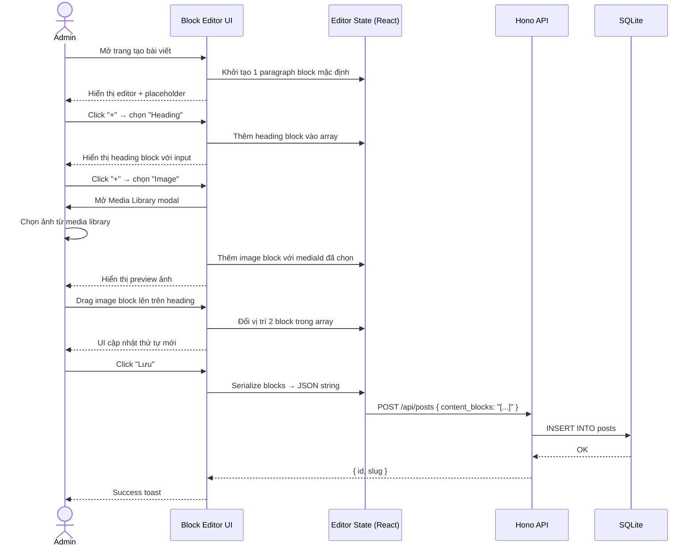
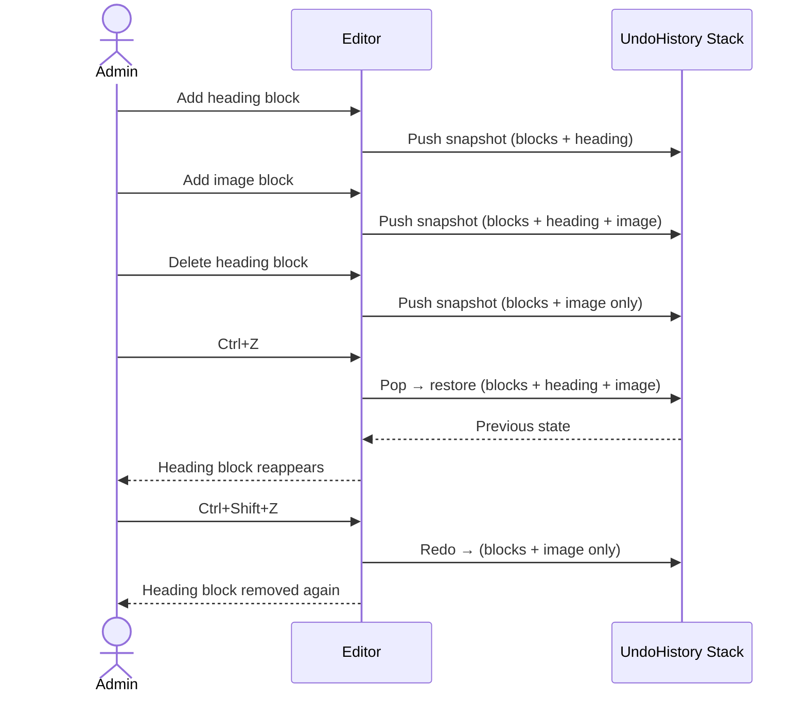
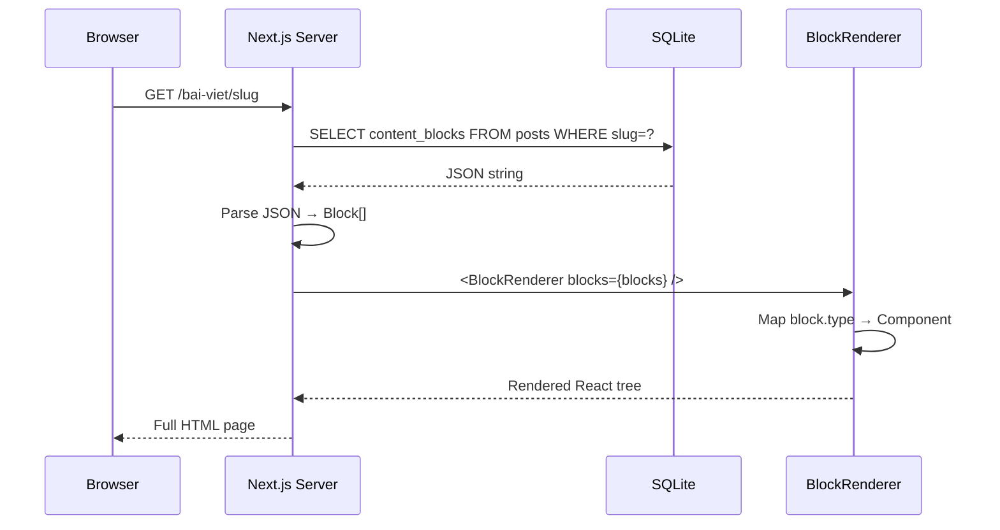
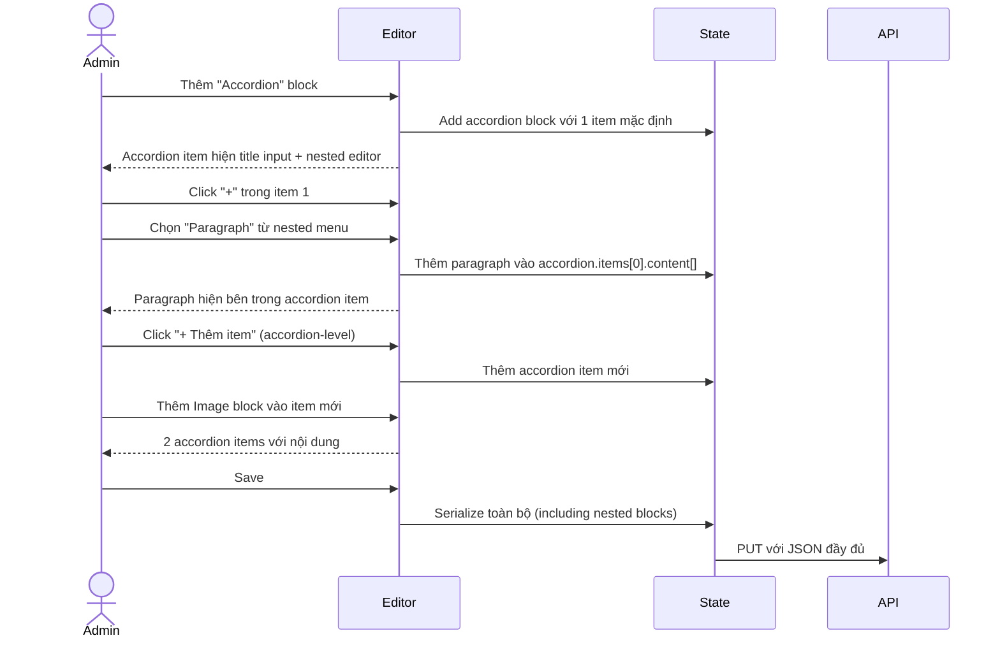

# BRD 02: Block-Based Content Editor

**Document Type:** Business Requirements Document  
**Module:** Block Content Editor  
**Version:** 1.0  
**Date:** 2026-07-21  
**Owner:** Admin  
**Ref Spec:** `.docs/specs/02-block-content-editor.md`  
**Ref Blueprint:** `DYNAMIC-CONVERSION-BLUEPRINT.md` Section 9  

---

## 1. Business Background

Website hiện tại chứa nội dung bài viết dưới dạng HTML thô trong 1 textarea. Admin (thường là người làm nội dung, không phải developer) gặp khó khăn: không thể tạo layout đẹp, không chèn được carousel/accordion/video, HTML dễ vỡ layout, không nhất quán giữa các bài. Cần 1 editor trực quan kiểu Notion/Webflow, cho phép tạo nội dung bằng cách thêm các "block" có sẵn.

**Mục tiêu:** Cung cấp Block Editor với 21+ block types, admin kéo-thả để tạo nội dung. Mỗi block có giao diện cấu hình riêng. Nội dung lưu dưới dạng JSON có cấu trúc, render thành React components nhất quán.

---

## 2. Business Requirements

| ID | Requirement | Priority | Rationale |
|----|------------|----------|-----------|
| BR-02.1 | Admin tạo nội dung bằng cách thêm block (heading, paragraph, image, video, gallery, carousel, accordion, CTA, columns...) | Must Have | Thay thế hoàn toàn textarea HTML |
| BR-02.2 | Kéo-thả để sắp xếp lại thứ tự blocks | Must Have | UX trực quan, tiết kiệm thời gian |
| BR-02.3 | Mỗi block type có form cấu hình riêng phù hợp (VD: image có nút chọn từ media library, video có input paste YouTube URL) | Must Have | Dễ dùng, không cần biết code |
| BR-02.4 | Hỗ trợ Undo/Redo (Ctrl+Z / Ctrl+Shift+Z) | Should Have | An toàn khi chỉnh sửa |
| BR-02.5 | Hỗ trợ nested blocks (columns chứa blocks, accordion chứa blocks, tabs chứa blocks) | Should Have | Layout phức tạp, chuyên nghiệp |
| BR-02.6 | Slash command `/` để thêm block nhanh bằng bàn phím | Nice to Have | Power user, tăng tốc độ nhập liệu |
| BR-02.7 | Nội dung lưu dưới dạng JSON có cấu trúc, KHÔNG phải HTML | Must Have | Dễ migrate, search, render consistent |
| BR-02.8 | Block Renderer hiển thị nội dung nhất quán trên mọi thiết bị | Must Have | Responsive, chuyên nghiệp |

---

## 3. Stakeholders & Actors

| Actor | Role | Concern |
|-------|------|---------|
| **Content Admin** | Người tạo bài viết/khóa học | Editor trực quan, dễ dùng, xem được preview |
| **Website Visitor** | Người đọc bài viết | Nội dung đẹp, load nhanh, responsive |
| **Developer** | Người maintain hệ thống | Dễ thêm block type mới, schema rõ ràng |

---

## 4. Business Rules

| ID | Rule | Enforcement |
|----|------|-------------|
| BR-R1 | Mỗi block instance có UUID duy nhất | Client-side UUID v4 generation |
| BR-R2 | Block type quyết định schema data của block đó | Zod discriminated union |
| BR-R3 | Unknown block type khi render → log warning, không crash | BlockRenderer try-catch |
| BR-R4 | Gallery block yêu cầu tối thiểu 2 ảnh | Client validation |
| BR-R5 | Blocks array rỗng → render nothing | Component-level check |
| BR-R6 | Undo history tối đa 50 bước | useUndoHistory hook |
| BR-R7 | Content blocks lưu vào cột `content_blocks TEXT` (JSON stringified) | Database |

---

## 5. Input / Output

### 5.1 Input: Block Types & Their Data

#### Typography Group
| Block Type | Input Fields | Source |
|-----------|-------------|--------|
| **heading** | text, level (H1-H6), alignment | Text input + dropdown |
| **paragraph** | text, alignment, dropCap toggle | Textarea |
| **quote** | text, author, style (default/bordered/pull) | Textarea + input + select |
| **list** | items[], type (ul/ol/checklist) | Multi-input |
| **code** | code, language, showLineNumbers | Textarea + select |
| **callout** | text, variant (info/warning/tip/danger), icon | Textarea + select + emoji |

#### Media Group
| Block Type | Input Fields | Source |
|-----------|-------------|--------|
| **image** | mediaId, alt, caption, width (full/wide/contained/inline), border, rounded | Media Library picker + text inputs |
| **video** | mediaId (YouTube), caption, aspectRatio, autoplay | YouTube URL input → auto-extract ID |
| **gallery** | images[{mediaId, caption}], columns (2/3/4), gap, layout (grid/masonry) | Media Library multi-select |
| **carousel** | slides[{mediaId, caption}], autoplay, interval, showDots, showArrows | Media Library multi-select + config |
| **beforeAfter** | beforeMediaId, beforeLabel, afterMediaId, afterLabel | Media Library x2 |

#### Layout Group
| Block Type | Input Fields | Note |
|-----------|-------------|------|
| **divider** | style (solid/dashed/dotted/gradient) | Select only |
| **spacer** | height (px, 8-200) | Number input + slider |
| **columns** | columns (2/3/4), content[][], gap | Mỗi column là nested Block Editor |
| **tabs** | tabs[{label, content[]}] | Mỗi tab chứa nested blocks |

#### Interactive Group
| Block Type | Input Fields | Note |
|-----------|-------------|------|
| **accordion** | items[{title, content[]}], allowMultiple | Nested blocks trong mỗi item |
| **collapse** | title, content[], defaultOpen | Nested blocks |
| **timeline** | events[{date, title, description}] | Form list |
| **table** | headers[], rows[][], striped, compact | Table editor |

#### Conversion Group
| Block Type | Input Fields | Note |
|-----------|-------------|------|
| **cta** | heading, text, buttonText, buttonUrl, style, backgroundMediaId | Form + media picker |
| **pricingTable** | plans[{name, price, period, description, features[], cta, highlighted}] | Form list |
| **testimonial** | testimonialId (DB reference), style | Dropdown select từ testimonials table |

### 5.2 Output: JSON Structure
```json
{
  "blocks": [
    {
      "id": "uuid-1",
      "type": "heading",
      "data": { "level": 2, "text": "Tiêu đề", "alignment": "left" }
    },
    {
      "id": "uuid-2",
      "type": "image",
      "data": { "mediaId": "img-123", "alt": "Mô tả", "width": "wide" }
    }
  ]
}
```

### 5.3 Output: Frontend Render
`<BlockRenderer blocks={blocks} />` → map mỗi block type đến React component tương ứng với SCSS module riêng, GSAP animation, responsive.

---

## 6. Process Flow

### 6.1 Admin Create Content Flow


### 6.2 Undo/Redo Flow


### 6.3 Visitor View Content Flow


### 6.4 Nested Blocks Flow (Accordion)


---

## 7. Data Flow

```
┌────────────────────────────────────────────┐
│            BLOCK EDITOR (Admin)            │
│                                            │
│  ┌─────────┐  ┌────────┐  ┌────────────┐   │
│  │Toolbar  │  │Blocks  │  │  Preview   │   │
│  │(+ menu, │  │ List   │  │  (toggle)  │   │
│  │ undo,   │  │(drag-  │  │            │   │
│  │ redo)   │  │ gable) │  │            │   │
│  └─────────┘  └───┬────┘  └────────────┘   │
│                   │                        │
│            ┌──────▼──────┐                 │
│            │ Block State │                 │
│            │ Block[] JSON│                 │
│            └──────┬──────┘                 │
└───────────────────┼────────────────────────┘
                    │ Save
                    ▼
         ┌─────────────────────┐
         │   HONO API          │
         │   POST/PUT /posts   │
         └──────────┬──────────┘
                    │
         ┌──────────▼──────────┐
         │   SQLite             │
         │   content_blocks TEXT│
         └──────────┬──────────┘
                    │ Read
                    ▼
┌────────────────────────────────────────────┐
│           FRONTEND RENDER                   │
│                                             │
│  BlockRenderer                              │
│  ┌──────────────────────────────────────┐  │
│  │ Map block.type → React Component     │  │
│  │                                      │  │
│  │ heading → <HeadingBlock data />      │  │
│  │ paragraph → <ParagraphBlock data />  │  │
│  │ image → <ImageBlock data />          │  │
│  │ accordion → <AccordionBlock data />  │  │
│  │   └─ nested <BlockRenderer />        │  │
│  │ columns → <ColumnsBlock data />      │  │
│  │   └─ nested <BlockRenderer />        │  │
│  │ ...                                  │  │
│  └──────────────────────────────────────┘  │
└────────────────────────────────────────────┘
```

---

## 8. Integration Points

| Integration | Direction | Description |
|-------------|-----------|-------------|
| Media Library Modal | Image/Video/Gallery/Carousel blocks → Media | Mở modal chọn media (Spec 04) |
| Testimonials Table | Testimonial block → DB | Dropdown select testimonial |
| Blog Posts | Post content → Block Editor | Bài viết dùng block editor |
| Course Content | Course intro → Block Editor | Giới thiệu khóa học dùng blocks |
| Course Lessons | Lesson content → Block Editor | Nội dung bài học type=text dùng blocks |

---

## 9. Constraints & Assumptions

### Constraints
- **21 block types** được định nghĩa sẵn, developer thêm block mới bằng cách: thêm Zod schema + React component + đăng ký vào registry
- **Không hỗ trợ custom CSS per block** (v1)
- **Không có collaborative editing** (single user)
- **Không hỗ trợ version history** của content blocks (v1)

### Assumptions
- Admin có kiến thức cơ bản về layout web (cột, accordion, carousel là gì)
- Media đã được upload sẵn trước khi chèn vào blocks
- Block types hiện tại đủ cho nhu cầu nội dung (có thể mở rộng sau)

---

## 10. Success Metrics

| Metric | Target |
|--------|--------|
| Thời gian tạo 1 bài viết trung bình | < 15 phút |
| Admin không cần biết HTML | 100% block-based |
| Tỉ lệ lỗi render block | < 0.1% page views |
| Undo/Redo reliability | 100% operations reversible |
| Thời gian thêm block type mới (dev) | < 2 giờ/block type |
