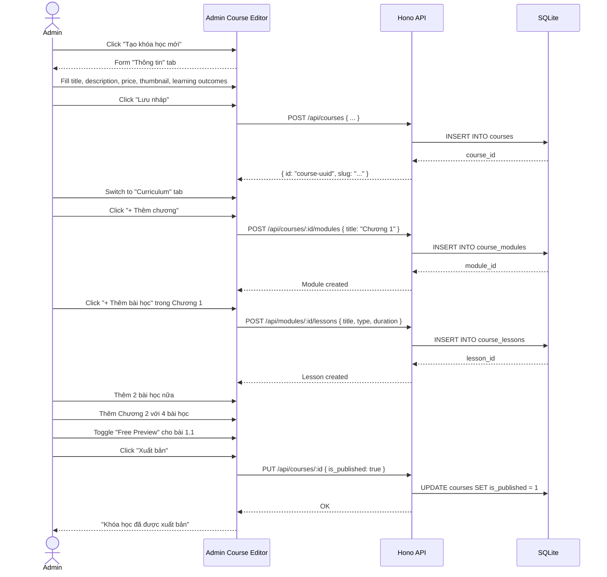
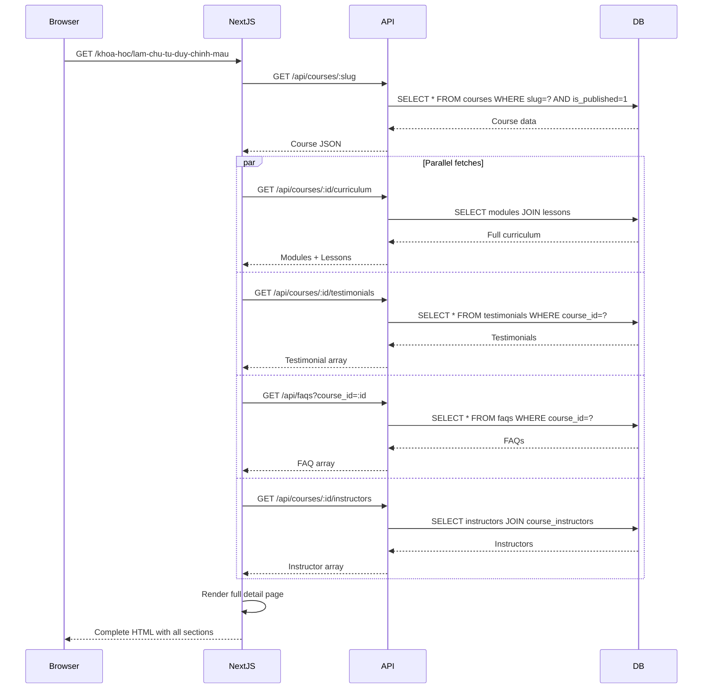
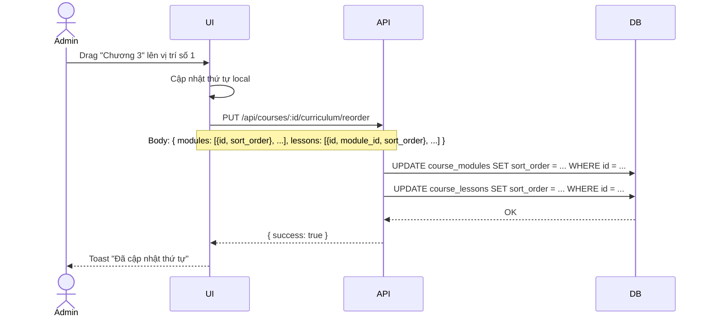

# BRD 03: Course Management & Curriculum Builder

**Document Type:** Business Requirements Document  
**Module:** Course Management + Curriculum Builder  
**Version:** 1.0  
**Date:** 2026-07-21  
**Owner:** Admin  
**Ref Spec:** `.docs/specs/03-course-management-curriculum.md`  
**Ref Blueprint:** `DYNAMIC-CONVERSION-BLUEPRINT.md` Section 2.2-2.6, Section 10  

---

## 1. Business Background

Minh Travel bán các khóa học online về quay dựng video, chỉnh màu, content creation. Hiện tại khóa học được hiển thị bằng mock data tĩnh. Khi có khóa học mới hoặc thay đổi nội dung, admin phải sửa code. Đặc biệt, không có curriculum chi tiết (modules → lessons), học viên không biết mình sẽ học gì trong từng chương — khác xa trải nghiệm của Udemy/Coursera.

**Mục tiêu:** Xây dựng hệ thống quản lý khóa học toàn diện: admin CRUD khóa học với curriculum builder (modules → lessons), instructor, bonuses. Trang detail khóa học hiển thị đầy đủ: learning outcomes, curriculum accordion, instructor profile, testimonials, FAQ — giúp học viên quyết định mua hàng.

---

## 2. Business Requirements

| ID | Requirement | Priority | Rationale |
|----|------------|----------|-----------|
| BR-03.1 | Admin CRUD khóa học với metadata đầy đủ (title, price, thumbnail, trailer, level, certificate, learning outcomes...) | Must Have | Quản lý danh mục khóa học |
| BR-03.2 | Curriculum Builder: admin tạo cấu trúc Modules → Lessons với drag-drop sắp xếp | Must Have | Học viên thấy rõ lộ trình học |
| BR-03.3 | Mỗi lesson có type (video/text/quiz/assignment), duration, free preview toggle | Must Have | Đa dạng loại nội dung, cho phép học thử |
| BR-03.4 | Admin quản lý Bonuses (ưu đãi kèm theo) cho từng khóa học | Should Have | Tăng giá trị cảm nhận |
| BR-03.5 | Admin gán Instructors cho khóa học (many-to-many) | Must Have | Học viên biết ai dạy |
| BR-03.6 | Trang detail hiển thị curriculum accordion, instructor card, testimonials, FAQs | Must Have | Tăng tỉ lệ chuyển đổi (enrollment) |
| BR-03.7 | Learning outcomes hiển thị dạng checklist grid | Should Have | Trực quan, dễ scan |
| BR-03.8 | Tự động tính tổng thời lượng, tổng số bài của khóa học | Should Have | Tiết kiệm thời gian admin |

---

## 3. Business Rules

| ID | Rule |
|----|------|
| BR-R1 | Slug course là unique, auto-generate từ title, cho phép edit thủ công |
| BR-R2 | Course có thể ở trạng thái draft (chỉ admin thấy) hoặc published (public) |
| BR-R3 | Featured courses hiển thị trên homepage (tối đa N course, sort theo featured_order) |
| BR-R4 | Combo-only courses không có nút "Mua ngay" riêng, chỉ mua trong combo |
| BR-R5 | Learning outcomes là array string, tối thiểu 4 outcomes cho course published |
| BR-R6 | Mỗi module có ít nhất 1 lesson, mỗi course có ít nhất 1 module |
| BR-R7 | Sort order của modules và lessons phải liên tục (1,2,3...) |
| BR-R8 | Instructor phải tồn tại trong DB trước khi gán vào course |

---

## 4. Input / Output

### 4.1 Course Entity Input
| Field | Type | Required | Source |
|-------|------|----------|--------|
| title | string | Yes | Text input |
| slug | string | Yes (auto) | Auto + editable |
| subtitle | string | No | Text input |
| description | string | Yes | Textarea |
| content_blocks | JSON | No | Block Editor (Spec 02) |
| base_price | integer | Yes | Number input (VND) |
| original_price | integer | No | Number input |
| thumbnail_url | media_id | Yes | Media Library picker |
| trailer_video_url | media_id | No | YouTube media picker |
| external_checkout_url | string | No | URL input |
| level | enum | No | Select (beginner/intermediate/advanced/all) |
| certificate | boolean | No | Toggle |
| is_published | boolean | No | Toggle |
| is_featured_on_home | boolean | No | Toggle |
| is_combo_only | boolean | No | Toggle |
| button_text | string | No | Text input (override "Mua ngay") |
| learning_outcomes | string[] | No | Multi-input |
| prerequisites | string[] | No | Multi-input |
| target_audience | string | No | Textarea |

### 4.2 Curriculum Input
```
Course
 └── Module 1 (title, description, learning_outcomes, sort_order)
      ├── Lesson 1.1 (title, description, type, duration, video_url, is_free_preview, sort_order)
      ├── Lesson 1.2
      └── Lesson 1.3 (...)
 └── Module 2 (...)
```

### 4.3 Course Detail Page Output
```
┌──────────────────────────────────────────────────────┐
│ HERO SECTION                                         │
│  - Trailer video (YouTube)                           │
│  - Title, subtitle, description                      │
│  - Price, rating, student count                      │
│  - Badges: level, language, certificate              │
│  - CTA button → checkout URL                         │
├──────────────────────────────────────────────────────┤
│ LEARNING OUTCOMES (Grid 2 columns)                   │
│  ✅ Outcome 1    ✅ Outcome 2                         │
│  ✅ Outcome 3    ✅ Outcome 4                         │
├──────────────────────────────────────────────────────┤
│ CURRICULUM ACCORDION                                 │
│  ▶ Chương 1: ... (3 bài • 25:00)                    │
│    ├ Bài 1.1: ... (08:15) [Preview]                  │
│    ├ Bài 1.2: ... (10:30)                            │
│    └ Bài 1.3: ... (06:15)                            │
│  ▶ Chương 2: ... (4 bài • 35:00)                    │
├──────────────────────────────────────────────────────┤
│ INSTRUCTOR CARD                                      │
│  - Avatar, name, title, bio, rating, social links    │
├──────────────────────────────────────────────────────┤
│ TESTIMONIALS (Grid cards)                            │
├──────────────────────────────────────────────────────┤
│ FAQ ACCORDION                                        │
├──────────────────────────────────────────────────────┤
│ STICKY CTA (on scroll)                               │
└──────────────────────────────────────────────────────┘
```

---

## 5. Process Flow

### 5.1 Admin Create Course with Curriculum


### 5.2 Visitor View Course Detail


### 5.3 Admin Reorder Curriculum


---

## 6. Data Models

```
┌─────────────┐       ┌──────────────────┐       ┌─────────────────┐
│  courses     │1────*│ course_modules    │1────*│ course_lessons   │
│─────────────│       │──────────────────│       │─────────────────│
│ id (PK)     │       │ id (PK)          │       │ id (PK)         │
│ slug (UQ)   │       │ course_id (FK)   │       │ module_id (FK)  │
│ title       │       │ title            │       │ title           │
│ base_price  │       │ description      │       │ description     │
│ ...         │       │ learning_outcomes│       │ type            │
└──────┬──────┘       │ sort_order       │       │ duration_seconds│
       │              └──────────────────┘       │ video_url       │
       │                                         │ is_free_preview │
       │1──*┌──────────────┐                     │ content_blocks  │
       ├────│course_bonuses│                     │ sort_order      │
       │    │──────────────│                     └─────────────────┘
       │    │ id (PK)      │
       │    │ course_id(FK)│
       │    │ name         │
       │    │ value        │
       │    └──────────────┘
       │
       │*──*┌───────────────────┐       ┌──────────────┐
       └────│course_instructors │*────1─│ instructors  │
            │───────────────────│       │──────────────│
            │ course_id (FK)    │       │ id (PK)      │
            │ instructor_id(FK) │       │ name         │
            └───────────────────┘       │ title        │
                                        │ bio          │
                                        │ avatar_url   │
                                        │ rating       │
                                        │ social_links │
                                        └──────────────┘
```

---

## 7. Integration Points

| Integration | Description |
|-------------|-------------|
| Media Library (Spec 04) | Thumbnail, trailer video dùng media_id |
| Block Editor (Spec 02) | content_blocks cho course intro |
| Testimonials (Spec 07) | Hiển thị trên course detail |
| FAQs (Spec 07) | Hiển thị trên course detail |
| Promotions (Spec 07) | Badge giảm giá trên course card |

---

## 8. Success Metrics

| Metric | Target |
|--------|--------|
| Thời gian tạo 1 khóa học mới (có curriculum) | < 30 phút |
| Course detail page load time | < 3 giây |
| Tỉ lệ visitor scroll hết curriculum | > 60% |
| Enrollment conversion rate | Tăng 20% so với trước khi có curriculum |
