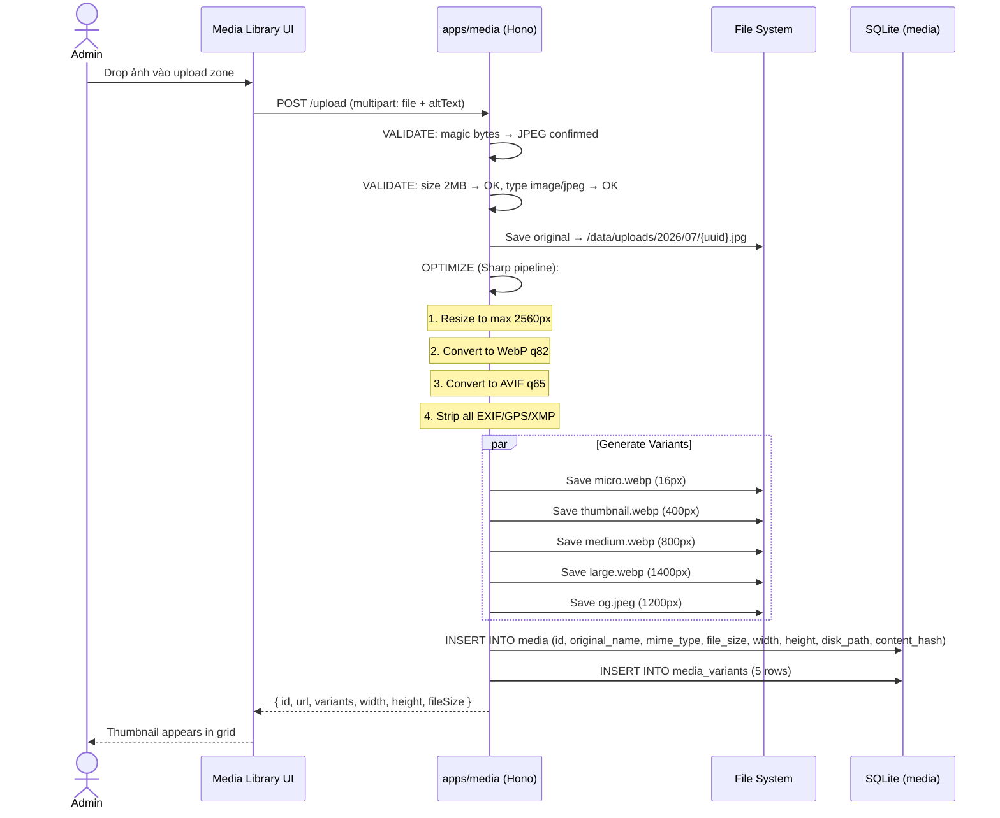
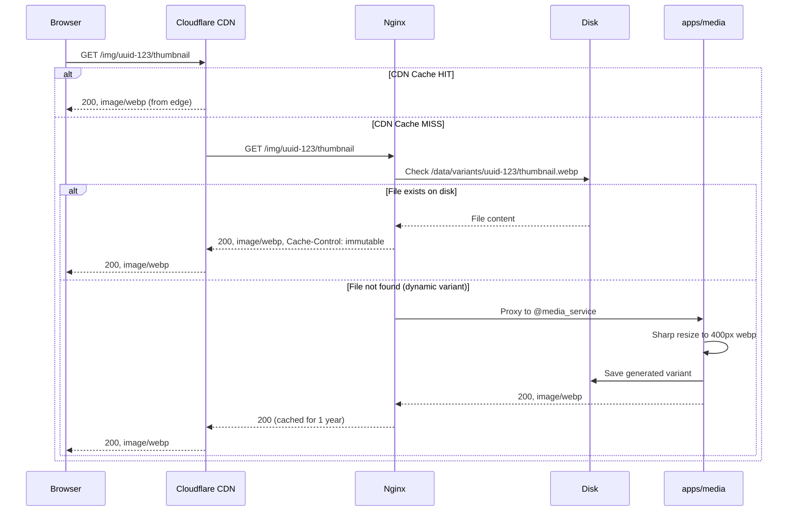
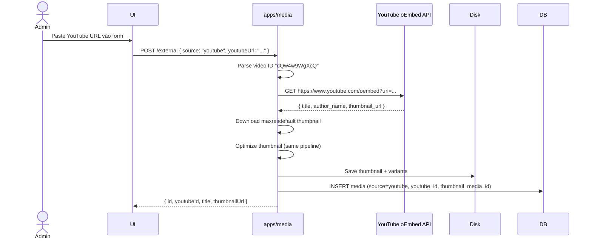
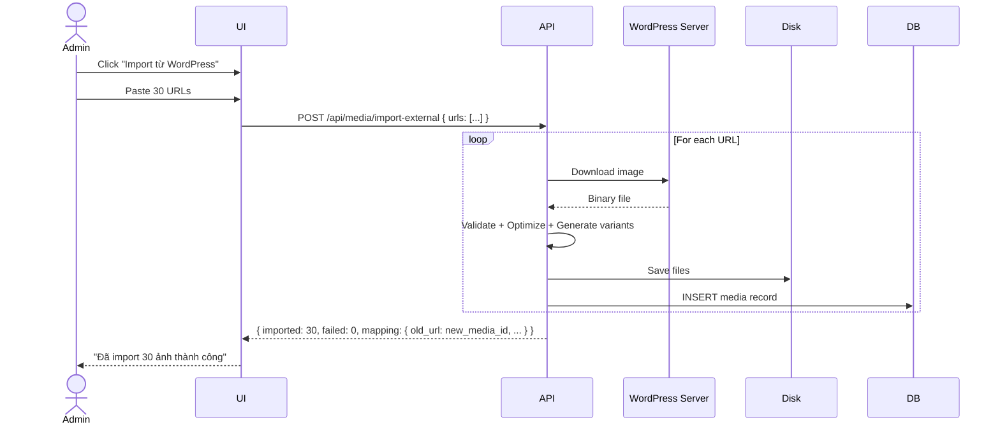

# BRD 04: Media Microservice (apps/media)

**Document Type:** Business Requirements Document  
**Module:** Media Microservice  
**Version:** 1.0  
**Date:** 2026-07-21  
**Owner:** System  
**Ref Spec:** `.docs/specs/04-media-microservice.md`  
**Ref Blueprint:** `DYNAMIC-CONVERSION-BLUEPRINT.md` Section 7  

---

## 1. Business Background

Website sử dụng rất nhiều ảnh (30+ ảnh hiện tại từ WordPress cũ, sẽ còn tăng) và video YouTube (hero banner, portfolio, trailer khóa học). Hiện tại tất cả ảnh trỏ đến URL ngoài `minhtravel.vn/wp-content/uploads/...` — không kiểm soát được, không optimize, không có CDN. Mỗi lần thêm ảnh mới admin phải upload lên WordPress riêng rồi paste URL.

**Mục tiêu:** Xây dựng Media Microservice tập trung: upload ảnh → tự động optimize (resize, webp, variants) → serve qua CDN-friendly URLs. Hỗ trợ YouTube embed và external URL reference. Admin có Media Library để quản lý tất cả media trong 1 nơi.

---

## 2. Business Requirements

| ID | Requirement | Priority |
|----|------------|----------|
| BR-04.1 | Admin upload ảnh (JPEG, PNG, WebP, AVIF, GIF, SVG) qua drag-drop | Must Have |
| BR-04.2 | Tự động optimize ảnh sau upload: resize max 2560px, convert WebP+AVIF, strip EXIF | Must Have |
| BR-04.3 | Pre-generate 5 variants (micro 16px, thumbnail 400px, medium 800px, large 1400px, og 1200px JPEG) | Must Have |
| BR-04.4 | Hỗ trợ on-the-fly resize qua query params (`?w=600&f=webp`) + cache kết quả | Should Have |
| BR-04.5 | Hỗ trợ YouTube video reference (lưu video ID, tự fetch thumbnail) | Must Have |
| BR-04.6 | Hỗ trợ external URL reference cho ảnh chưa migrate | Should Have |
| BR-04.7 | Media Library UI: grid view, search, filter, delete | Must Have |
| BR-04.8 | Media picker modal tái sử dụng được từ mọi form (course, article, settings...) | Must Have |
| BR-04.9 | Nginx serve static files trực tiếp từ disk (bỏ qua Bun) | Should Have |
| BR-04.10 | CDN-ready URLs: immutable, cache 1 năm, content-hash | Should Have |
| BR-04.11 | Batch import 30 ảnh từ WordPress cũ | Nice to Have |

---

## 3. Business Rules

| ID | Rule |
|----|------|
| BR-R1 | Chỉ nhận file có MIME type trong whitelist (image, video, pdf) |
| BR-R2 | Validate bằng magic bytes, không tin extension/MIME từ client |
| BR-R3 | Max file size: 50MB ảnh, 500MB video, 100MB document |
| BR-R4 | UUID filename, không dùng tên gốc (chống path traversal) |
| BR-R5 | Strip tất cả metadata (EXIF, GPS, IPTC, XMP) khỏi ảnh upload |
| BR-R6 | Ảnh gốc được giữ lại (không xóa sau optimize) |
| BR-R7 | Không phóng to ảnh nhỏ hơn target size (withoutEnlargement) |
| BR-R8 | Variant URLs là immutable — một khi tạo, không đổi |
| BR-R9 | Xóa media → xóa file gốc + tất cả variants trên disk + DB record |
| BR-R10 | Upload/Delete yêu cầu auth admin |

---

## 4. Input / Output

### 4.1 Upload Input
```
POST /upload
Content-Type: multipart/form-data
Body:
  - file: binary
  - altText: string (optional)

Validation:
  ✓ Magic bytes check
  ✓ MIME whitelist
  ✓ File size limit
  ✓ Extension whitelist
```

### 4.2 Upload Output
```json
{
  "id": "uuid-abc-123",
  "url": "/img/uuid-abc-123/medium",
  "originalName": "photo.jpg",
  "mimeType": "image/jpeg",
  "fileSize": 2048576,
  "width": 2560,
  "height": 1440,
  "variants": {
    "micro": "/img/uuid-abc-123/micro",
    "thumbnail": "/img/uuid-abc-123/thumbnail",
    "medium": "/img/uuid-abc-123/medium",
    "large": "/img/uuid-abc-123/large",
    "og": "/img/uuid-abc-123/og"
  }
}
```

### 4.3 Serve Image Output
```
GET /img/{id}/thumbnail  → 200, image/webp, 400px, Cache-Control: max-age=31536000
GET /img/{id}?w=600&f=avif&q=75 → 200, image/avif, 600px (resize on-the-fly, cached)
GET /img/non-existent  → 404
```

### 4.4 YouTube Input
```json
POST /external
{
  "source": "youtube",
  "youtubeUrl": "https://www.youtube.com/watch?v=dQw4w9WgXcQ",
  "altText": "Video hướng dẫn"
}
```

### 4.5 YouTube Output
```json
{
  "id": "uuid-yt-456",
  "source": "youtube",
  "youtubeId": "dQw4w9WgXcQ",
  "title": "Video Title from YouTube",
  "thumbnailMediaId": "uuid-thumb-789",
  "thumbnailUrl": "/img/uuid-thumb-789/medium"
}
```

---

## 5. Process Flow

### 5.1 Upload & Optimize Flow


### 5.2 Image Serve Flow (Nginx + CDN Production)


### 5.3 YouTube Reference Flow


### 5.4 Batch Import WordPress Images


---

## 6. Data Flow

```
┌──────────────────────────────────────────────────────────┐
│                    MEDIA SOURCES                          │
│                                                           │
│  ┌──────────┐    ┌──────────────┐    ┌───────────────┐   │
│  │  Upload   │    │   YouTube    │    │ External URL  │   │
│  │  (file)   │    │  (video ID)  │    │  (URL ref)    │   │
│  └─────┬─────┘    └──────┬───────┘    └───────┬───────┘   │
│        │                 │                    │           │
└────────┼─────────────────┼────────────────────┼───────────┘
         │                 │                    │
         ▼                 ▼                    ▼
┌──────────────────────────────────────────────────────────┐
│              apps/media (Hono, port 3002)                 │
│                                                           │
│  ┌──────────┐  ┌──────────┐  ┌───────────────────────┐  │
│  │Validator │─▶│ Storage  │─▶│  Optimizer (Sharp)    │  │
│  │(magic    │  │(/data/   │  │  - Resize max 2560    │  │
│  │ bytes,   │  │ uploads/)│  │  - WebP q82 + AVIF    │  │
│  │ size,    │  │          │  │  - Strip EXIF          │  │
│  │ type)    │  │          │  │  - 5 variants          │  │
│  └──────────┘  └──────────┘  └───────────┬───────────┘  │
│                                          │               │
│         ┌────────────────────────────────┘               │
│         ▼                                                │
│  ┌──────────────┐    ┌──────────────────────┐           │
│  │ SQLite (meta)│    │ /data/variants/      │           │
│  │ media table  │    │ {uuid}/              │           │
│  │ variants     │    │   micro.webp         │           │
│  └──────────────┘    │   thumbnail.webp     │           │
│                      │   medium.webp        │           │
│                      │   large.webp         │           │
│                      │   og.jpeg            │           │
│                      └──────────────────────┘           │
└──────────────────────────┬───────────────────────────────┘
                           │
              ┌────────────┴────────────┐
              │                         │
              ▼                         ▼
┌─────────────────────┐    ┌──────────────────────────┐
│   NGINX (Prod)      │    │  CDN (Cloudflare)        │
│   /img/* → disk     │    │  Cache /img/* immutable  │
│   try_files → @api  │    │  Edge serve globally     │
└─────────────────────┘    └──────────────────────────┘
              │                         │
              └────────────┬────────────┘
                           ▼
                    ┌─────────────┐
                    │   Browser   │
                    │   │
                    └─────────────┘
```

---

## 7. Success Metrics

| Metric | Target |
|--------|--------|
| Upload + optimize time (ảnh 5MB) | < 3 giây |
| Image size reduction (vs original) | > 60% |
| CDN cache hit rate | > 95% |
| Ảnh serve time (CDN hit) | < 50ms |
| Ảnh serve time (on-the-fly resize lần đầu) | < 500ms |
| Zero EXIF data leak | 100% stripped |
| WordPress migrate success rate | 100% (30/30) |
