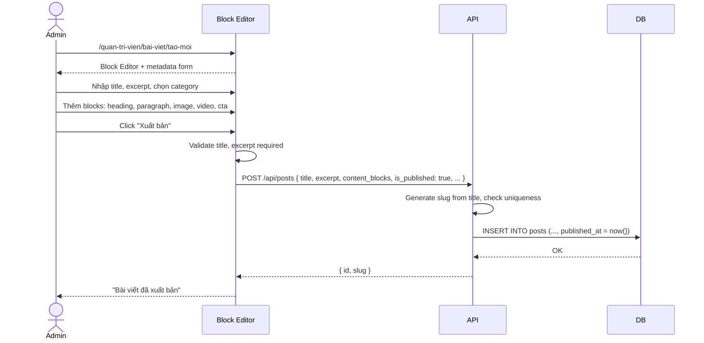
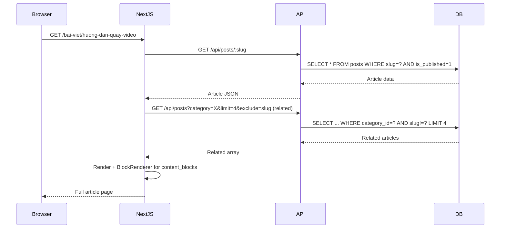

# BRD 05: Blog & Article Management

**Document Type:** Business Requirements Document
**Module:** Blog & Article Management
**Version:** 1.0 | **Date:** 2026-07-21
**Ref Spec:** `.docs/specs/05-blog-article-management.md`

---

## 1. Business Background

Website có blog chia sẻ kiến thức về quay dựng video — đây là kênh SEO chính thu hút traffic organic. Hiện tại 6 bài viết mock data đều có content rỗng. Admin cần công cụ tạo bài viết chuyên nghiệp, hỗ trợ SEO, phân loại theo danh mục.

---

## 2. Business Requirements

| ID | Requirement | Priority |
|----|------------|----------|
| BR-05.1 | Admin CRUD danh mục (categories): name, slug | Must Have |
| BR-05.2 | Admin CRUD bài viết dùng Block Editor (Spec 02) | Must Have |
| BR-05.3 | SEO metadata per article: title, description, slug, OG image | Must Have |
| BR-05.4 | Publish/Draft workflow | Must Have |
| BR-05.5 | Frontend blog listing page với pagination | Must Have |
| BR-05.6 | Frontend blog detail + related articles (4 bài liên quan) | Must Have |

---

## 3. Business Rules

| ID | Rule |
|----|------|
| BR-R1 | Chỉ published articles mới hiển thị trên public site |
| BR-R2 | Slug bài viết là unique |
| BR-R3 | Khi xóa category → set category_id = NULL cho posts thuộc category đó (không xóa posts) |
| BR-R4 | View counter tăng khi visitor xem detail (có dedup cơ bản) |
| BR-R5 | Related articles = cùng category, exclude current, limit 4, sort by published_at DESC |

---

## 4. Input / Output

### Input: Article Entity
| Field | Type | Required | Source |
|-------|------|----------|--------|
| title | string | Yes | Text input |
| slug | string | Auto | Auto + editable |
| excerpt | string | Yes | Textarea |
| content_blocks | JSON | Yes | Block Editor |
| thumbnail_url | media_id | No | Media Library |
| category_id | FK | No | Dropdown select |
| author | string | No | Text input |
| read_time | integer | Auto | Auto calc (words/200) or manual |
| seo_description | string | No | Textarea + char counter |
| is_published | boolean | No | Toggle |
| published_at | datetime | Auto | Set on first publish |

### Output: Frontend Article Detail
```
┌────────────────────────────────────────────┐
│ Breadcrumb: Home > Blog > Article Title     │
├────────────────────────────────────────────┤
│ Article Meta: Date • Read Time • Author     │
├────────────────────────────────────────────┤
│ Title (H1)                                  │
├────────────────────────────────────────────┤
│ Block Content (BlockRenderer)               │
│  - Heading                                  │
│  - Paragraph                                │
│  - Image (wide)                             │
│  - Video (16:9)                             │
│  - Accordion                                │
│  - CTA                                      │
├────────────────────────────────────────────┤
│ Related Articles (4 cards)                  │
└────────────────────────────────────────────┘
```

---

## 5. Process Flow

### 5.1 Admin Publish Article Flow


### 5.2 Visitor Read Article Flow


---

## 6. Success Metrics

| Metric | Target |
|--------|--------|
| Thời gian tạo bài viết | < 20 phút |
| Article page LCP | < 2.5s |
| SEO score (Lighthouse) | > 90 |
| Bounce rate article page | < 60% |
