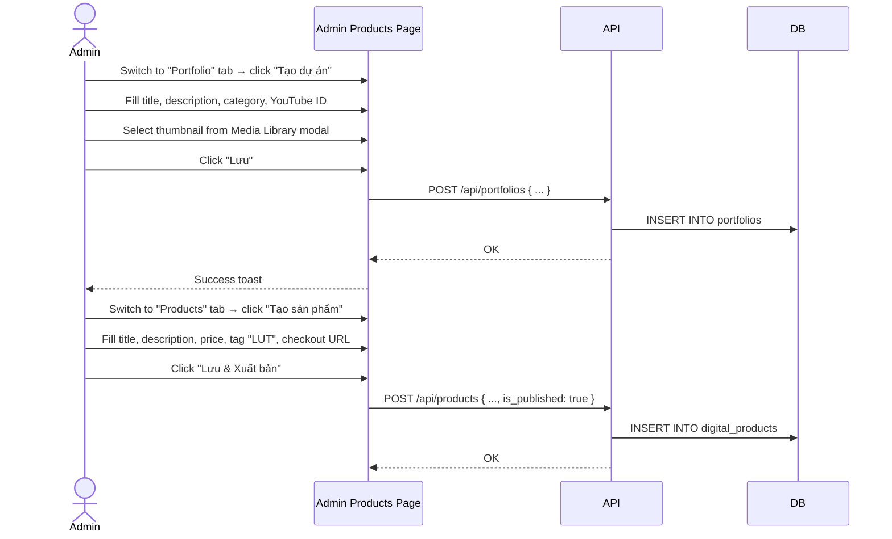

# BRD 06: Portfolio & Digital Products Management

**Document Type:** Business Requirements Document
**Module:** Portfolio & Digital Products
**Version:** 1.0 | **Date:** 2026-07-21
**Ref Spec:** `.docs/specs/06-portfolio-products-management.md`

---

## 1. Business Background

Minh Travel có 2 loại nội dung showcase: (1) Portfolio — dự án phim đã thực hiện (travel films, TVC, tutorials), (2) Digital Products — sản phẩm số bán kèm (LUT màu, preset ảnh). Cả 2 đều cần hiển thị trên website để thể hiện năng lực và tạo doanh thu phụ.

---

## 2. Business Requirements

| ID | Requirement | Priority |
|----|------------|----------|
| BR-06.1 | Admin CRUD portfolio items (title, description, category, thumbnail, video URL) | Must Have |
| BR-06.2 | Featured portfolio items hiển thị trên homepage (có flag + order) | Should Have |
| BR-06.3 | Admin CRUD digital products (title, description, price, thumbnail, external checkout URL, tag) | Must Have |
| BR-06.4 | Product "Mua ngay" button → external checkout URL | Must Have |
| BR-06.5 | Portfolio listing page dynamic (title, subtitle, CTA từ site_settings) | Must Have |
| BR-06.6 | Products listing page dynamic (title, subtitle từ site_settings) | Must Have |

---

## 3. Business Rules

| ID | Rule |
|----|------|
| BR-R1 | Portfolio category là free-text string (có thể thêm category mới tùy ý) |
| BR-R2 | Product giá là integer (VND), format khi render |
| BR-R3 | Product is_published = false → không hiển thị trên public |
| BR-R4 | Portfolio CTA section lấy text+link từ site_settings, không hardcode |
| BR-R5 | Featured items sort theo featured_order ASC |

---

## 4. Input / Output

### Portfolio Entity
| Field | Type | Required |
|-------|------|----------|
| title | string | Yes |
| description | string | No |
| category | string | Yes |
| thumbnail_url | media_id | No |
| full_video_url | string | No |
| youtube_video_id | string | No |
| is_featured_on_home | boolean | No |
| featured_order | integer | No |

### Digital Product Entity
| Field | Type | Required |
|-------|------|----------|
| title | string | Yes |
| description | string | Yes |
| price | integer | Yes |
| thumbnail_url | media_id | No |
| external_checkout_url | string | No |
| tag | string | No |
| youtube_preview_id | string | No |
| is_published | boolean | No |
| is_featured_on_home | boolean | No |

---

## 5. Process Flow

---

## 6. Success Metrics

| Metric | Target |
|--------|--------|
| Portfolio page load | < 2s |
| Product page load | < 2s |
| Click-through rate (Mua ngay button) | > 5% |
