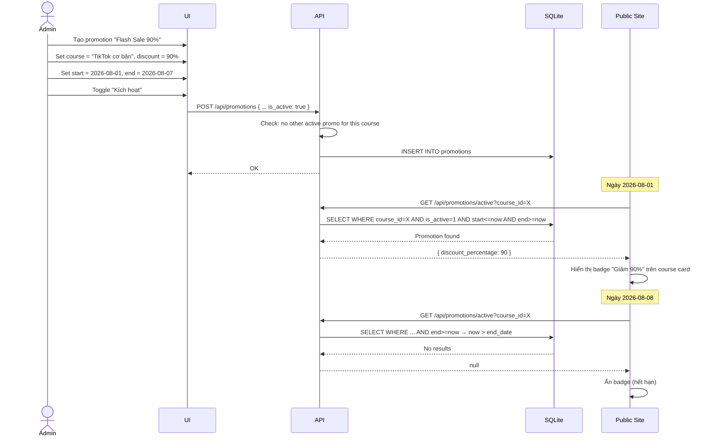

# BRD 07: FAQ, Testimonials & Promotions Management

**Document Type:** Business Requirements Document
**Module:** FAQ, Testimonials & Promotions
**Version:** 1.0 | **Date:** 2026-07-21
**Ref Spec:** `.docs/specs/07-faq-testimonials-promotions.md`

---

## 1. Business Background

Ba module nhỏ nhưng quan trọng cho conversion:
- **FAQ:** Giải đáp thắc mắc của học viên tiềm năng, giảm rào cản mua hàng
- **Testimonials:** Social proof từ học viên cũ, tăng niềm tin
- **Promotions:** Chiến dịch giảm giá, tạo urgency (FOMO)

---

## 2. Business Requirements

| ID | Requirement | Priority |
|----|------------|----------|
| BR-07.1 | Admin CRUD FAQs (question, answer, gắn với course hoặc global) | Must Have |
| BR-07.2 | FAQs hiển thị accordion trên course detail và course listing page | Must Have |
| BR-07.3 | Admin CRUD testimonials (name, role, rating, quote, avatar, course) | Must Have |
| BR-07.4 | Featured testimonials hiển thị trên homepage | Should Have |
| BR-07.5 | Testimonials per course hiển thị trên course detail | Must Have |
| BR-07.6 | Admin CRUD promotions (campaign name, discount %, date range, course, active toggle) | Should Have |
| BR-07.7 | Active promotion hiển thị badge "Giảm X%" trên course card | Should Have |
| BR-07.8 | Promotion tự động hết hiệu lực khi qua end_date | Must Have |

---

## 3. Business Rules

| ID | Rule |
|----|------|
| BR-R1 | FAQ có course_id = NULL → global FAQ (hiển thị mọi nơi) |
| BR-R2 | FAQ có course_id → chỉ hiển thị trên course detail đó |
| BR-R3 | Testimonial rating 1-5 sao |
| BR-R4 | Testimonial is_featured = true → hiển thị trên homepage |
| BR-R5 | Chỉ 1 promotion active cho mỗi course tại 1 thời điểm |
| BR-R6 | Promotion is_active = true + start_date <= now <= end_date → mới hiển thị |

---

## 4. Process Flow

### 4.1 Promotion Lifecycle

---

## 5. Success Metrics

| Metric | Target |
|--------|--------|
| FAQ coverage (câu hỏi phổ biến được trả lời) | 100% |
| Testimonial hiển thị đầy đủ (avatar, rating, quote) | 100% |
| Promotion tự động hết hạn chính xác | 100% |
