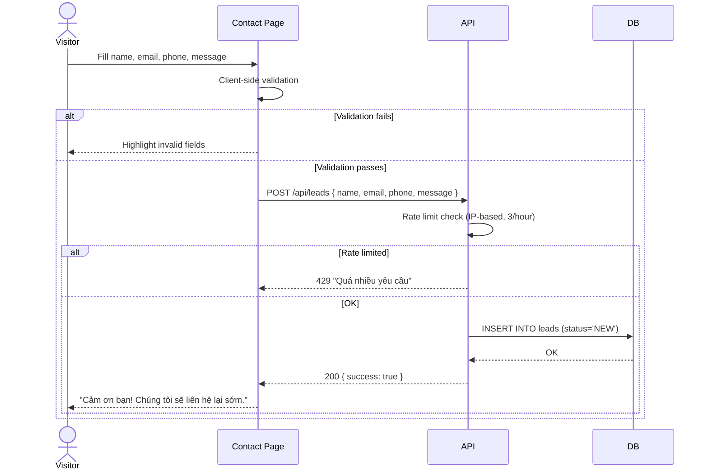
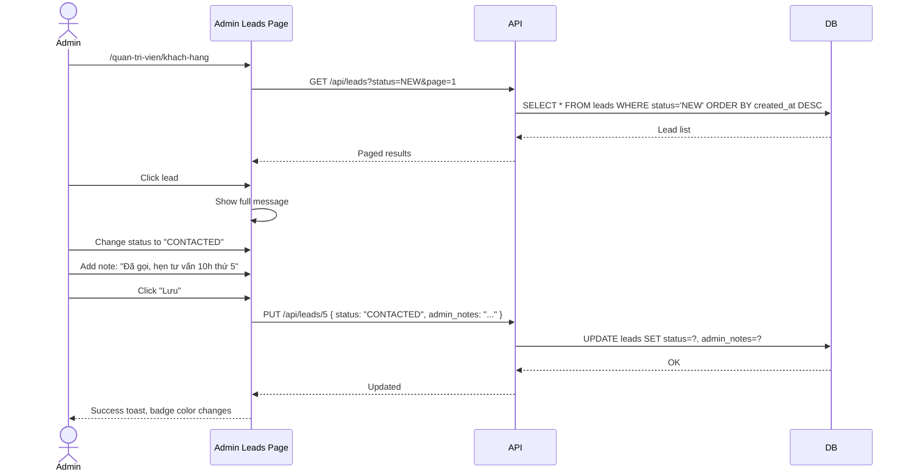

# BRD 08: Contact Form & Lead Management

**Document Type:** Business Requirements Document
**Module:** Contact & Lead Management
**Version:** 1.0 | **Date:** 2026-07-21
**Ref Spec:** `.docs/specs/08-contact-lead-management.md`

---

## 1. Business Background

Website cần kênh để khách hàng tiềm năng liên hệ (tư vấn khóa học, hợp tác, thắc mắc). Hiện tại form liên hệ chỉ hiển thị success message client-side, không gửi đi đâu, không lưu trữ. Admin không có cách nào xem và quản lý leads.

**Mục tiêu:** Form liên hệ gửi data về backend → lưu vào `leads` table. Admin có dashboard quản lý leads: xem, lọc theo status, ghi chú, đổi trạng thái (NEW → CONTACTED → CONVERTED → CANCELLED). Contact info (địa chỉ, phone, email) lấy từ site_settings.

---

## 2. Business Requirements

| ID | Requirement | Priority |
|----|------------|----------|
| BR-08.1 | Visitor submit contact form với name, email, phone, message | Must Have |
| BR-08.2 | Form validation (required fields, email format) | Must Have |
| BR-08.3 | Rate limiting: max 3 submissions/IP/giờ | Should Have |
| BR-08.4 | Admin xem danh sách leads, filter theo status | Must Have |
| BR-08.5 | Admin đổi status lead (NEW → CONTACTED → CONVERTED / CANCELLED) | Must Have |
| BR-08.6 | Admin ghi chú (admin_notes) cho mỗi lead | Should Have |
| BR-08.7 | Contact info (address, phone, email, hours) lấy từ site_settings | Must Have |
| BR-08.8 | Honeypot field chống spam bot (hidden input) | Nice to Have |

---

## 3. Business Rules

| ID | Rule |
|----|------|
| BR-R1 | New lead mặc định status = NEW |
| BR-R2 | Status flow: NEW → CONTACTED → CONVERTED (hoặc CANCELLED) |
| BR-R3 | CONVERTED và CANCELLED là terminal states (không đổi ngược lại) |
| BR-R4 | Rate limit theo IP, sliding window 1 giờ |
| BR-R5 | Contact info section fields trống → ẩn field đó (không hiện "N/A") |
| BR-R6 | Form submission là public (không cần auth) |

---

## 4. Input / Output

### Form Input
| Field | Type | Required | Validation |
|-------|------|----------|------------|
| name | string | Yes | Min 2 chars |
| email | string | Yes | Email format |
| phone | string | No | Optional |
| message | string | Yes | Min 10 chars |

### Lead Entity
| Field | Type |
|-------|------|
| id | UUID |
| customer_name | string |
| customer_email | string |
| customer_phone | string |
| message | text |
| course_id | FK (nullable) |
| status | enum: NEW, CONTACTED, CONVERTED, CANCELLED |
| admin_notes | text |
| created_at | datetime |

---

## 5. Process Flow

### 5.1 Visitor Submit Contact Form

### 5.2 Admin Manage Lead

---

## 6. Success Metrics

| Metric | Target |
|--------|--------|
| Form submission success rate | > 99% |
| Spam submissions | < 5% |
| Lead response time (admin) | < 24h |
| Lead → conversion rate | Theo dõi qua dashboard |
