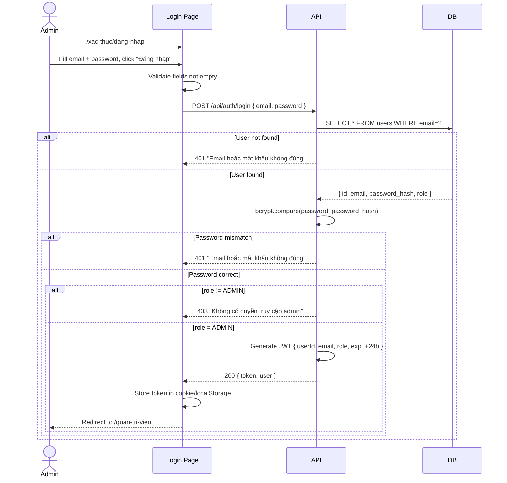
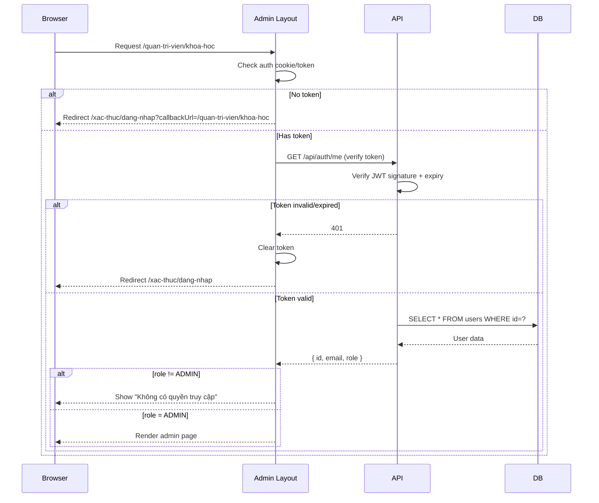
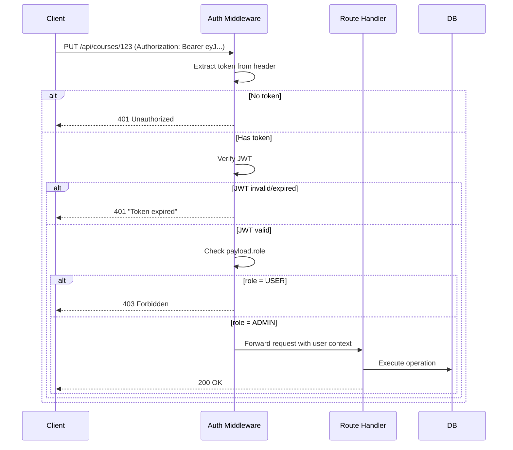

# BRD 09: Authentication & Admin Guard

**Document Type:** Business Requirements Document
**Module:** Authentication & Access Control
**Version:** 1.0 | **Date:** 2026-07-21
**Ref Spec:** `.docs/specs/09-authentication-admin-guard.md`

---

## 1. Business Background

Admin Dashboard chứa toàn bộ dữ liệu và cấu hình website. Nếu không có authentication, bất kỳ ai cũng có thể truy cập và thay đổi nội dung. Cần hệ thống phân quyền rõ ràng: Admin (toàn quyền) vs User (học viên, chỉ xem khóa học đã mua).

**Mục tiêu:** Xây dựng authentication system với email/password + Google OAuth. Admin guard bảo vệ tất cả route `/quan-tri-vien/*` và API admin endpoints. User thường có thể đăng ký tài khoản để mua khóa học.

---

## 2. Business Requirements

| ID | Requirement | Priority |
|----|------------|----------|
| BR-09.1 | Admin đăng nhập bằng email + password | Must Have |
| BR-09.2 | Admin đăng nhập bằng Google OAuth (chỉ user role=ADMIN mới vào được admin) | Should Have |
| BR-09.3 | Visitor đăng ký tài khoản học viên (role=USER) | Should Have |
| BR-09.4 | JWT-based authentication, token expire 24h | Must Have |
| BR-09.5 | Middleware bảo vệ tất cả API endpoints: thiếu token → 401, sai role → 403 | Must Have |
| BR-09.6 | Admin pages redirect về login nếu chưa authenticate | Must Have |
| BR-09.7 | Logout xóa token, redirect về login | Must Have |
| BR-09.8 | Mật khẩu hash bằng bcrypt, không lưu plaintext | Must Have |

---

## 3. Business Rules

| ID | Rule |
|----|------|
| BR-R1 | Admin role được set trong DB (không thể tự nâng cấp từ register) |
| BR-R2 | Google login user mới → role USER mặc định |
| BR-R3 | Token chứa: userId, email, role, exp |
| BR-R4 | API admin endpoints yêu cầu role=ADMIN (không chỉ authenticated) |
| BR-R5 | Chỉ có 1 admin user ban đầu (seed migration) |
| BR-R6 | Password min 8 ký tự |
| BR-R7 | Token lưu trong httpOnly cookie (prod) hoặc Authorization header |

---

## 4. Input / Output

### Login Input
| Field | Type | Required |
|-------|------|----------|
| email | string | Yes |
| password | string | Yes |

### Login Output
```json
// Success 200
{ "token": "eyJ...", "user": { "id": "...", "email": "...", "name": "...", "role": "ADMIN" } }

// Fail 401
{ "error": "Email hoặc mật khẩu không đúng" }
```

### Register Input
| Field | Type | Required |
|-------|------|----------|
| name | string | Yes |
| email | string | Yes |
| password | string | Yes (min 8 chars) |
| confirmPassword | string | Yes (must match) |

---

## 5. Process Flow

### 5.1 Admin Login Flow


### 5.2 Auth Guard Flow (Admin Page Access)


### 5.3 API Auth Guard Flow


---

## 6. Security Architecture

```
┌─────────────────────────────────────────────┐
│            SECURITY LAYERS                   │
│                                              │
│  1. Transport: HTTPS (production)            │
│  2. Password: bcrypt hash (cost 12)         │
│  3. Token: JWT HS256, expire 24h            │
│  4. Storage: httpOnly Secure cookie          │
│  5. CSRF: SameSite=Strict cookie            │
│  6. Rate Limit: 5 login attempts/IP/15min   │
│  7. Admin Check: role === 'ADMIN'            │
└─────────────────────────────────────────────┘
```

---

## 7. Success Metrics

| Metric | Target |
|--------|--------|
| Login success rate | > 99% |
| Unauthorized access blocked | 100% |
| Token verification time | < 5ms |
| Password never stored in plaintext | 100% |
