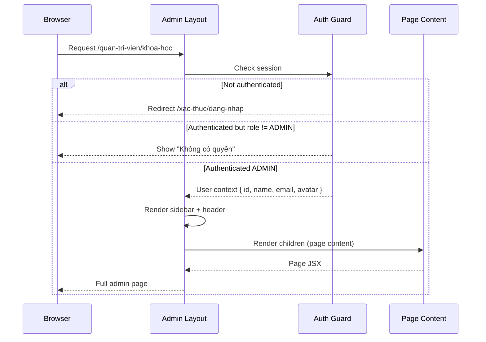
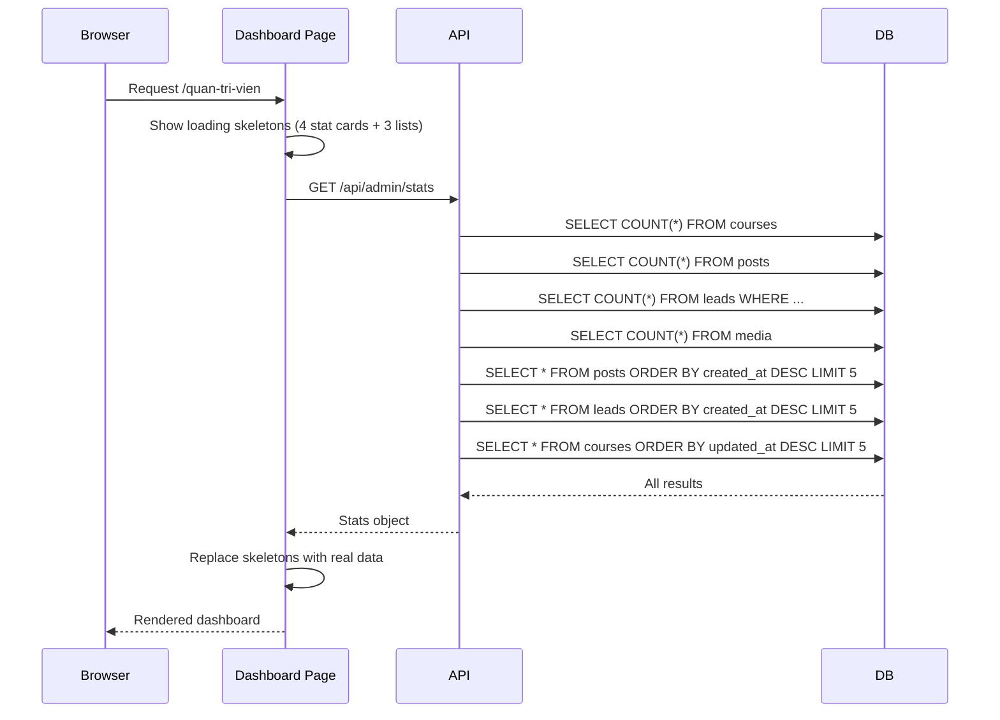
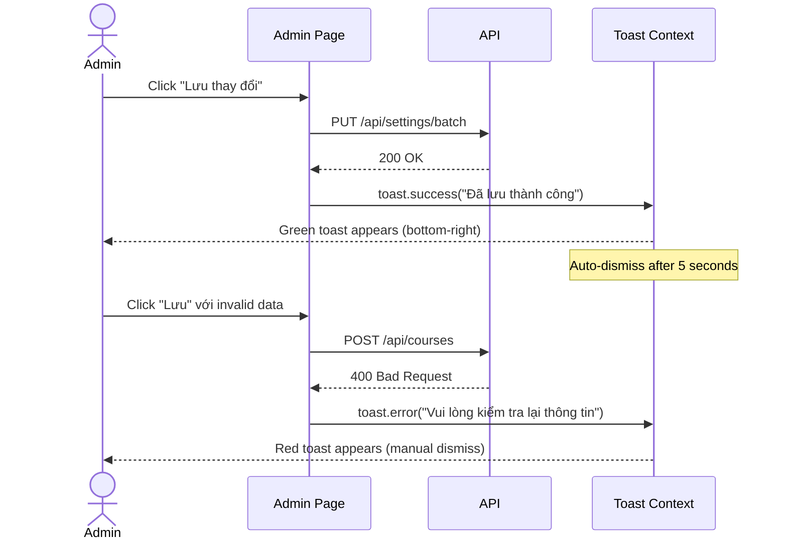
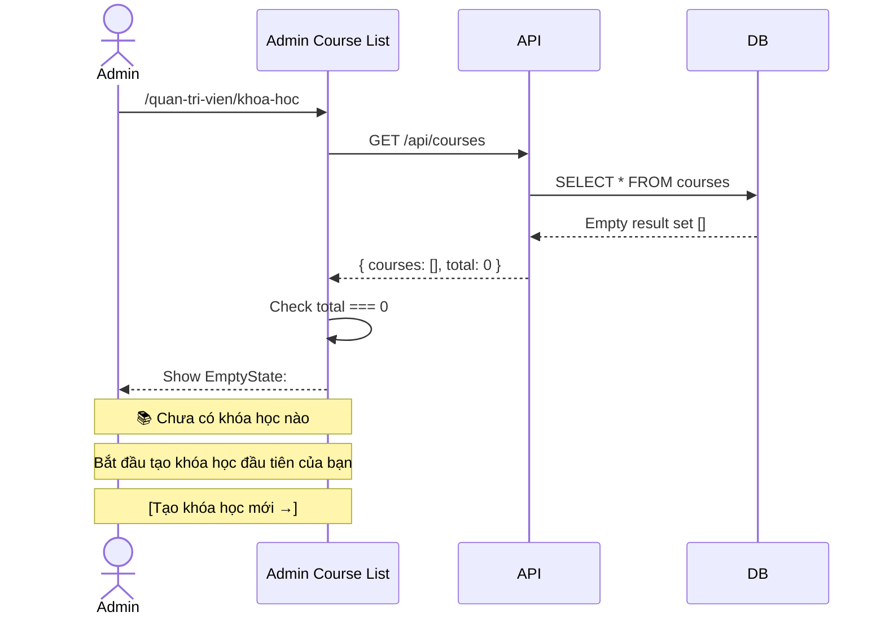

# BRD 10: Admin Dashboard Shell

**Document Type:** Business Requirements Document
**Module:** Admin Dashboard Shell (Layout + Overview)
**Version:** 1.0 | **Date:** 2026-07-21
**Ref Spec:** `.docs/specs/10-admin-dashboard-shell.md`

---

## 1. Business Background

Admin cần 1 giao diện quản lý tập trung (dashboard) để truy cập tất cả các module: Settings, Courses, Blog, Portfolio, Products, FAQs, Testimonials, Leads, Promotions, Media. Hiện tại tất cả admin pages là stub rỗng. Cần 1 shell layout nhất quán với sidebar navigation, dashboard overview thống kê, và các UI pattern dùng chung (toast, loading, empty state, breadcrumbs).

**Mục tiêu:** Xây dựng Admin Dashboard Shell làm nền tảng cho tất cả Spec 01-09 hoạt động. Layout chuẩn (sidebar + header + content), dashboard overview với key metrics, hệ thống toast notification, loading/empty/error states tái sử dụng.

---

## 2. Business Requirements

| ID | Requirement | Priority |
|----|------------|----------|
| BR-10.1 | Admin layout: sidebar left (260px, sticky) + header top + content area | Must Have |
| BR-10.2 | Sidebar 10 navigation items với icon + label, active highlight theo pathname | Must Have |
| BR-10.3 | Header: logo, user avatar dropdown (Đăng xuất) | Must Have |
| BR-10.4 | Dashboard overview: 4 stat cards (courses, posts, leads, media) | Must Have |
| BR-10.5 | Dashboard overview: recent items lists (5 newest posts, leads, courses) | Should Have |
| BR-10.6 | Toast notification system (success, error, warning, info) | Must Have |
| BR-10.7 | Loading skeleton state cho mọi data table/form | Should Have |
| BR-10.8 | Empty state component: illustration + message + CTA button | Should Have |
| BR-10.9 | Error state component: message + retry button | Should Have |
| BR-10.10 | Breadcrumbs tự động từ URL path | Nice to Have |
| BR-10.11 | Responsive: sidebar collapse trên mobile/tablet | Should Have |
| BR-10.12 | Auth guard: kiểm tra session, redirect login nếu chưa auth | Must Have |

---

## 3. Business Rules

| ID | Rule |
|----|------|
| BR-R1 | Admin layout chỉ render khi user authenticated + role=ADMIN |
| BR-R2 | Sidebar items hiển thị giống nhau cho tất cả admin (không phân quyền theo module ở v1) |
| BR-R3 | Dashboard stats lấy từ API counts (real-time, không cache dài) |
| BR-R4 | Toast auto-dismiss: success/info 5s, error/warning manual dismiss |
| BR-R5 | Max 5 toasts hiển thị cùng lúc (stack) |
| BR-R6 | Admin pages KHÔNG dùng layout public (SiteHeader/SiteFooter) — layout riêng biệt |

---

## 4. Input / Output

### Dashboard Stats Output
```json
GET /api/admin/stats
{
  "courses": { "total": 8, "published": 6 },
  "posts": { "total": 6, "published": 6 },
  "leads": { "new_today": 3, "new_this_week": 12 },
  "media": { "total": 30 },
  "recent_posts": [ { "id": "...", "title": "...", "published_at": "..." }, ... ],
  "recent_leads": [ { "id": "...", "customer_name": "...", "created_at": "..." }, ... ],
  "recent_courses": [ { "id": "...", "title": "...", "updated_at": "..." }, ... ]
}
```

### Sidebar Items
```typescript
[
  { icon: "📊", label: "Tổng quan", href: "/quan-tri-vien" },
  { icon: "⚙️", label: "Cài đặt", href: "/quan-tri-vien/cai-dat" },
  { icon: "📚", label: "Khóa học", href: "/quan-tri-vien/khoa-hoc" },
  { icon: "📝", label: "Bài viết", href: "/quan-tri-vien/bai-viet" },
  { icon: "🎬", label: "Dự án & Sản phẩm", href: "/quan-tri-vien/san-pham" },
  { icon: "❓", label: "FAQ", href: "/quan-tri-vien/faq" },
  { icon: "⭐", label: "Đánh giá", href: "/quan-tri-vien/danh-gia" },
  { icon: "👥", label: "Khách hàng", href: "/quan-tri-vien/khach-hang" },
  { icon: "🎁", label: "Khuyến mãi", href: "/quan-tri-vien/khuyen-mai" },
  { icon: "🖼️", label: "Media", href: "/quan-tri-vien/media" }
]
```

---

## 5. Process Flow

### 5.1 Admin Layout Render Flow


### 5.2 Dashboard Overview Load Flow


### 5.3 Toast Notification Flow


### 5.4 Empty State Flow


---

## 6. UI Layout Specification

```
┌──────────────────────────────────────────────────────────────────┐
│ HEADER (fixed, h-16)                                              │
│ ┌──────────────────────────────────────────────────────────────┐ │
│ │ 🎬 Minh Travel Admin          [Quick Actions]  👤 Admin ▼    │ │
│ └──────────────────────────────────────────────────────────────┘ │
├──────────┬───────────────────────────────────────────────────────┤
│ SIDEBAR  │ MAIN CONTENT (scrollable)                             │
│ (fixed,  │                                                       │
│  w-64)   │ ┌─────────────────────────────────────────────────┐  │
│          │ │ Breadcrumbs: Tổng quan > Khóa học                │  │
│          │ ├─────────────────────────────────────────────────┤  │
│ 📊 Tổng  │ │                                                   │  │
│    quan  │ │              PAGE CONTENT                         │  │
│ ⚙️ Cài   │ │                                                   │  │
│    đặt   │ │  (Spec 01-09 pages render here)                  │  │
│ 📚 Khóa  │ │                                                   │  │
│    học ← │ │                                                   │  │
│ 📝 Bài   │ │                                                   │  │
│    viết  │ │                                                   │  │
│ 🎬 Dự án │ │                                                   │  │
│ ❓ FAQ   │ │                                                   │  │
│ ⭐ Đánh  │ │                                                   │  │
│    giá   │ │                                                   │  │
│ 👥 Khách │ │                                                   │  │
│    hàng  │ │                                                   │  │
│ 🎁 Khuyến│ │                                                   │  │
│    mãi   │ │                                                   │  │
│ 🖼️ Media│ │                                                   │  │
│          │ └─────────────────────────────────────────────────┘  │
├──────────┴───────────────────────────────────────────────────────┤
│ TOAST CONTAINER (fixed, bottom-right)                             │
│ ┌──────────────────────────────┐                                  │
│ │ ✅ Đã lưu thành công     [x] │                                  │
│ └──────────────────────────────┘                                  │
└──────────────────────────────────────────────────────────────────┘
```

### Responsive Breakpoints
| Breakpoint | Sidebar | Content |
|------------|---------|---------|
| < 1024px (mobile/tablet) | Hidden, toggle by hamburger | Full width |
| >= 1024px (desktop) | Visible, 260px fixed | Remaining width |

---

## 7. Integration Points

| Integration | Description |
|-------------|-------------|
| Spec 09 (Auth) | Auth guard kiểm tra session trong layout |
| Spec 01-08 | Tất cả admin pages render trong content area |
| API `/api/admin/stats` | Dashboard overview stats |

---

## 8. Success Metrics

| Metric | Target |
|--------|--------|
| Admin page load time (first visit) | < 2s |
| Sidebar navigation time (page switch) | < 300ms (client-side) |
| Dashboard stats load time | < 1s |
| Toast reliability | 100% shown on success/error |
| Mobile responsiveness | Usable on 375px width |
