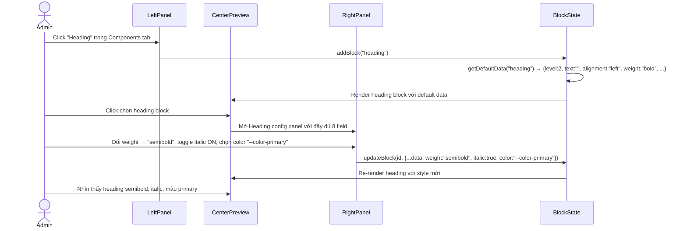
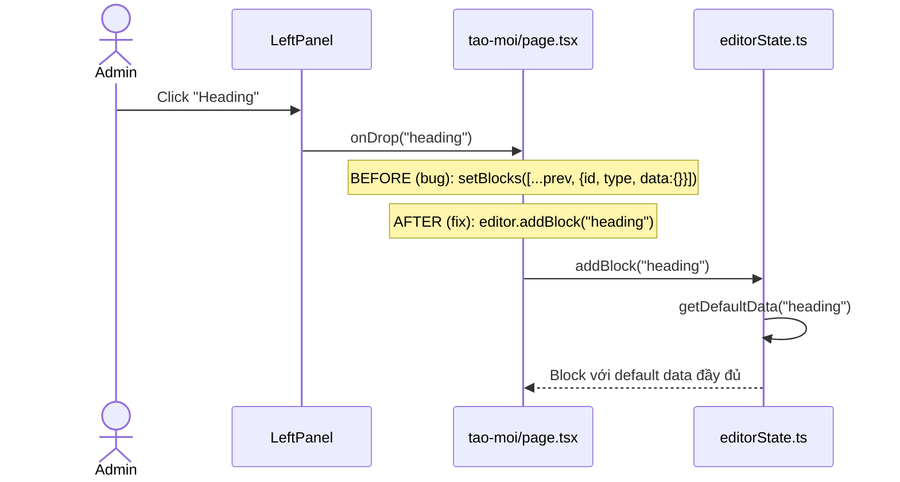

# BRD 11: Block Editor V2 — Config Panel & Renderers Hoàn Chỉnh

**Document Type:** Business Requirements Document
**Module:** Block Editor V2
**Version:** 1.0
**Date:** 2026-07-24
**Owner:** Admin
**Ref Spec:** `.docs/specs/12-block-editor-v2-config-renderers.md`
**Ref Brainstorming:** `.docs/BLOCK-EDITOR-BRAINSTORMING.md`
**Ref Spec Gốc:** `.docs/specs/02-block-content-editor.md`

---

## 1. Business Background (Bối cảnh nghiệp vụ)

Block Editor (Spec 02) đã được implement phase 1 với 22 block types, nhưng hiện trạng chỉ hoàn thiện **50%**:

- **4/22 block types** không có config panel (columns, tabs, accordion, collapse) → admin không thể cấu hình
- **14/22 renderer** là stub (placeholder text "Gallery: N images") → preview không phản ánh nội dung thật
- **Config panel quá cơ bản** ở nhiều block — image chỉ có boolean border/rounded, heading thiếu font weight/italic/underline, carousel thiếu transition effect...
- **Lỗi kỹ thuật**: blocks thêm từ panel có data rỗng, dead code tồn tại, stub pages thừa

Hệ quả: Admin **không thể tạo nội dung chuyên nghiệp** vì thiếu công cụ cấu hình chi tiết, và **không thể preview** nội dung sẽ hiển thị như thế nào.

**Mục tiêu:** Nâng cấp Block Editor lên 100% hoàn thiện — mọi block đều có config panel đầy đủ, mọi renderer hiển thị nội dung thực tế.

---

## 2. Business Requirements (Yêu cầu nghiệp vụ)

| ID | Requirement | Priority | Rationale |
|----|------------|----------|-----------|
| BR-11.1 | **22/22 block types có config panel đầy đủ** — không còn block "chưa có form cấu hình" | Must Have | Admin phải cấu hình được mọi block |
| BR-11.2 | **Typography styling mở rộng**: heading có font weight, italic, underline, color; paragraph có fontSize, lineHeight; callout có title; code có theme + copy button | Must Have | Cho phép tạo text đa dạng, biểu cảm |
| BR-11.3 | **Media styling mở rộng**: bo góc + border + shadow từ boolean → enum (nhiều level); thêm hoverZoom, lightbox, link, objectFit | Must Have | Ảnh/video trông chuyên nghiệp, nhất quán |
| BR-11.4 | **Carousel, Gallery, BeforeAfter có đầy đủ config**: transition effect, slides per view, pause on hover, orientation, lightbox | Must Have | Tạo media sections chất lượng cao |
| BR-11.5 | **Layout blocks có config**: columns có column ratios, tabs có tab style + default tab | Must Have | Layout linh hoạt, chuyên nghiệp |
| BR-11.6 | **Interactive blocks có config**: accordion/collapse có iconPosition, borderStyle; timeline có layout + icon + lineColor | Must Have | Interactive content đa dạng |
| BR-11.7 | **Conversion blocks có config**: CTA có buttonStyle/size/icon, pricing có currency/billingPeriod, testimonial có avatar/rating/background | Must Have | Tối ưu conversion |
| BR-11.8 | **Icon Picker** dùng Lucide icons — dùng chung cho quote, callout, CTA, timeline | Must Have | Nhất quán icon system |
| BR-11.9 | **Preview center hiển thị thực tế** — 22/22 renderers render nội dung thật (không còn stub) | Must Have | Admin biết chính xác nội dung sẽ hiển thị |
| BR-11.10 | **Fix lỗi nền tảng**: blocks từ panel có default data chuẩn, xóa dead code, xóa stub pages, typing hoạt động | Must Have | Editor hoạt động ổn định |

---

## 3. Stakeholders & Actors

| Actor | Role | Concern |
|-------|------|---------|
| **Content Admin** | Người tạo bài viết/khóa học | Config panel đầy đủ, preview chính xác, typing mượt |
| **Website Visitor** | Người đọc nội dung | Nội dung hiển thị đẹp, nhất quán |
| **Developer** | Người maintain | Schema rõ ràng, dễ mở rộng thêm config mới |

---

## 4. Business Rules

| ID | Rule | Enforcement |
|----|------|-------------|
| BR-R1 | Mỗi block khi thêm vào editor phải có **default data chuẩn** (không phải `{}`) | `getDefaultData(type)` trong editorState.ts |
| BR-R2 | Config field điều kiện chỉ hiển thị khi parent field được bật (VD: interval chỉ hiện khi autoplay ON) | Client-side conditional render |
| BR-R3 | `rounded`, `border` migration: boolean cũ → tự động convert sang enum | Backward-compat trong schema parse |
| BR-R4 | Unknown block type khi render → log warning, không crash | BlockRenderer try-catch |
| BR-R5 | Nested blocks (accordion, columns, tabs, collapse) có nested editor riêng trong panel | Expand-in-place UI |
| BR-R6 | Icon Picker dùng bộ Lucide icons có sẵn trong `@workspace/ui` | Shared component |
| BR-R7 | CSS variable dropdown chỉ hiển thị các màu từ theme (không cho chọn màu bất kỳ) | Design system constraint |

---

## 5. Input / Output Specification

### 5.1 Input: Admin Config Panel — Từng Block Type

#### Typography Group (cập nhật)

| Block Type | Input Fields (mới in đậm) |
|-----------|---------------------------|
| **heading** | text, level (1-6), alignment (left/center/right/**justify**), **weight** (regular/medium/semibold/bold), **italic**, **underline**, **color** |
| **paragraph** | text, alignment (left/center/right/**justify**), dropCap, **fontSize** (sm/md/lg), **lineHeight** (tight/normal/relaxed), **weight**, **color** |
| **quote** | text, author, style (default/bordered/pull), **icon** (Lucide picker, optional) |
| **callout** | text, variant, **icon** (Lucide picker), **title** (optional) |
| **code** | code, language (Select preset languages), showLineNumbers, **theme** (dark/light), **showCopyButton** |

#### Media Group (cập nhật)

| Block Type | Input Fields (mới in đậm) |
|-----------|---------------------------|
| **image** | mediaId, alt, caption, width, **rounded** (none/sm/md/lg/full — từ bool), **border** (none/thin/medium/thick — từ bool), **shadow** (none/sm/md/lg/xl), **hoverZoom**, **link**, **objectFit** |
| **video** | mediaId, caption, aspectRatio, **rounded**, **shadow**, **autoplay**, **loop**, **showControls**, **thumbnail** |
| **gallery** | images[], columns, gap, layout, **rounded**, **shadow**, **hoverZoom**, **lightbox** |
| **carousel** | slides[], autoplay, interval, showDots, showArrows, **transition** (slide/fade/cube), **rounded**, **shadow**, **aspectRatio**, **loop**, **pauseOnHover**, **slidesPerView** (1/2/3) |
| **beforeAfter** | beforeMediaId, afterMediaId, beforeLabel, afterLabel, caption, **orientation** (horizontal/vertical), **rounded**, **shadow** |

#### Layout Group (cập nhật)

| Block Type | Input Fields (mới in đậm) |
|-----------|---------------------------|
| **columns** | columns (2/3/4), gap (sm/md/lg), **columnRatios** (auto/50-50/33-33-33/25-75/75-25), content[] — nested blocks |
| **tabs** | tabs[], **tabStyle** (top/pills/vertical), **defaultTab**, content — nested blocks |

#### Interactive Group (cập nhật)

| Block Type | Input Fields (mới in đậm) |
|-----------|---------------------------|
| **accordion** | items[], allowMultiple, **iconPosition** (left/right), **defaultOpenIndex**, **borderStyle** (bordered/borderless) |
| **collapse** | title, content[], defaultOpen, **iconPosition** (left/right) |
| **timeline** | events[], **layout** (vertical/horizontal/alternating), **iconPerEvent** (Lucide picker), **lineColor** |

#### Conversion Group (cập nhật)

| Block Type | Input Fields (mới in đậm) |
|-----------|---------------------------|
| **cta** | heading, text, buttonText, buttonUrl, style, backgroundMediaId, **buttonStyle** (solid/outline/ghost), **buttonSize** (sm/md/lg), **buttonIcon** (Lucide picker) |
| **pricingTable** | plans[], **currency**, **billingPeriod** (monthly/yearly), **layout** (horizontal/vertical) |
| **testimonial** | testimonialId (Select from API), style, **showAvatar**, **showRating**, **avatarSize**, **background** |

### 5.2 Output: JSON Structure (ví dụ heading mới)

```json
{
  "id": "uuid-1",
  "type": "heading",
  "data": {
    "level": 2,
    "text": "Tiêu đề nổi bật",
    "alignment": "center",
    "weight": "bold",
    "italic": false,
    "underline": false,
    "color": "inherit"
  }
}
```

### 5.3 Output: Frontend Render

22/22 renderer hiển thị nội dung thực tế với đầy đủ styling từ config data.

---

## 6. Process Flow

### 6.1 Admin Config → Preview Flow



### 6.2 Bug Fix: LeftPanel → Default Data Flow



---

## 7. Data Flow

```
┌──────────────────────────────────────────────────────────────┐
│                    BLOCK EDITOR V2                             │
│                                                                │
│  ┌──────────┐   ┌──────────────┐   ┌───────────────────────┐  │
│  │LeftPanel │   │  Center      │   │  RightPanel            │  │
│  │          │   │  ┌─────────┐ │   │                        │  │
│  │ Thông tin│   │  │ Preview │ │   │  ┌─────────────────┐  │  │
│  │ tab      │   │  │ (22/22  │ │   │  │ Config Form     │  │  │
│  │          │   │  │  real)  │ │   │  │ ─────────────   │  │  │
│  │ Components│  │  │         │ │   │  │ Select          │  │  │
│  │ tab      │   │  └─────────┘ │   │  │ Toggle          │  │  │
│  │ ──────── │   │              │   │  │ TextInput       │  │  │
│  │ Search   │   │  ┌─────────┐ │   │  │ TextArea        │  │  │
│  │ ──────── │   │  │ Editor  │ │   │  │ NumberInput     │  │  │
│  │ Typograph│   │  │ (sortable│ │   │  │ IconPicker      │  │  │
│  │ y group  │   │  │  list)  │ │   │  │ CSS Var Dropdown│  │  │
│  │ Media    │   │  │         │ │   │  │ MediaPicker     │  │  │
│  │ group    │   │  └─────────┘ │   │  │ NestedEditor    │  │  │
│  │ Layout   │   │              │   │  └─────────────────┘  │  │
│  │ group    │   │              │   │                        │  │
│  │ Interact │   │              │   │   Move ▲ / ▼           │  │
│  │ ive      │   │              │   │   Duplicate ⧉          │  │
│  │ Conversi │   │              │   │   Delete ✕             │  │
│  │ on       │   │              │   │                        │  │
│  └──────────┘   └──────────────┘   └───────────────────────┘  │
│                                                                │
│                    Editor State (Block[] + History)             │
└──────────────────────────────────────────────────────────────┘
                             │ Save
                             ▼
                  ┌─────────────────────┐
                  │   HONO API          │
                  │   POST/PUT /posts   │
                  │   content_blocks TEXT│
                  └─────────────────────┘
```

---

## 8. Integration Points

| Integration | Direction | Description |
|-------------|-----------|-------------|
| Media Library | MediaPicker trong config panel | Chọn ảnh/video cho image, video, gallery, carousel, beforeAfter, CTA background |
| Testimonials API | Testimonial Select dropdown | Fetch danh sách testimonials từ `/api/testimonials` |
| Icon Picker (Lucide) | Shared component | Dùng chung cho quote, callout, CTA, timeline |
| CSS Variables | Theme CSS vars | Color dropdown chỉ chọn từ theme colors |
| Nested Block Editor | Expand-in-place trong config panel | Accordion, Columns, Tabs, Collapse có nested editor |

---

## 9. Constraints & Assumptions

### Constraints
- **Không hỗ trợ custom CSS per block** (v1)
- **Không có rich text inline formatting** (bold/italic trong cùng 1 paragraph — v1 dùng toàn block)
- **Color picker giới hạn theme CSS variables** — không chọn màu bất kỳ
- **Icon picker giới hạn Lucide icons** đã có trong `@workspace/ui`
- **Nested editor depth tối đa 3 levels** (để tránh UI quá phức tạp)

### Assumptions
- Admin có kiến thức cơ bản về typography và layout web
- Media đã được upload trước khi chèn vào blocks
- Lucide icons đã được cài đặt trong `@workspace/ui`

---

## 10. Success Metrics

| Metric | Target |
|--------|--------|
| Block types có config panel đầy đủ | 22/22 (100%) |
| Renderer hiển thị thực tế | 22/22 (100%) |
| Typing trong config panel → preview | < 50ms delay |
| Config field conditional logic | 100% chính xác (field chỉ hiện khi parent ON) |
| Backward compat (block cũ → schema mới) | 100% parse thành công |
| Bug: blocks từ panel có default data | data !== {} cho mọi block type |
