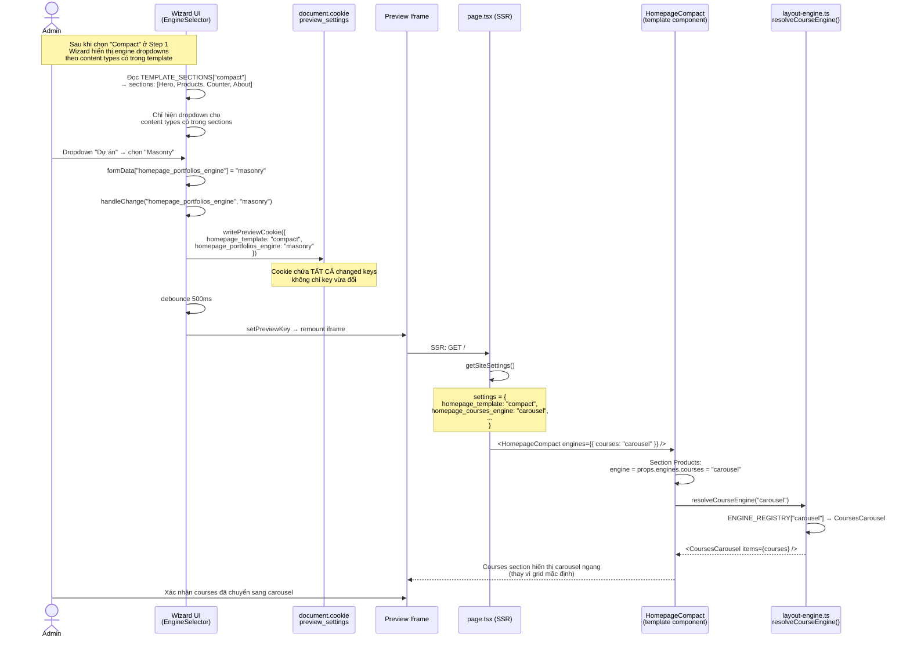
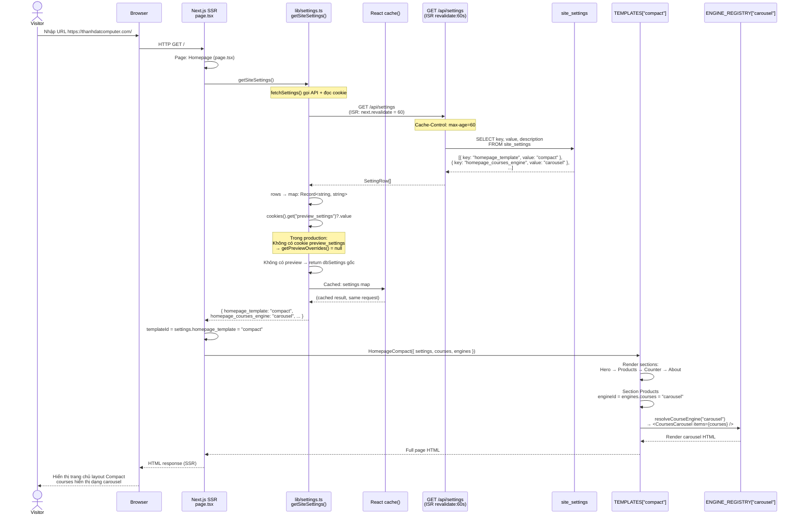
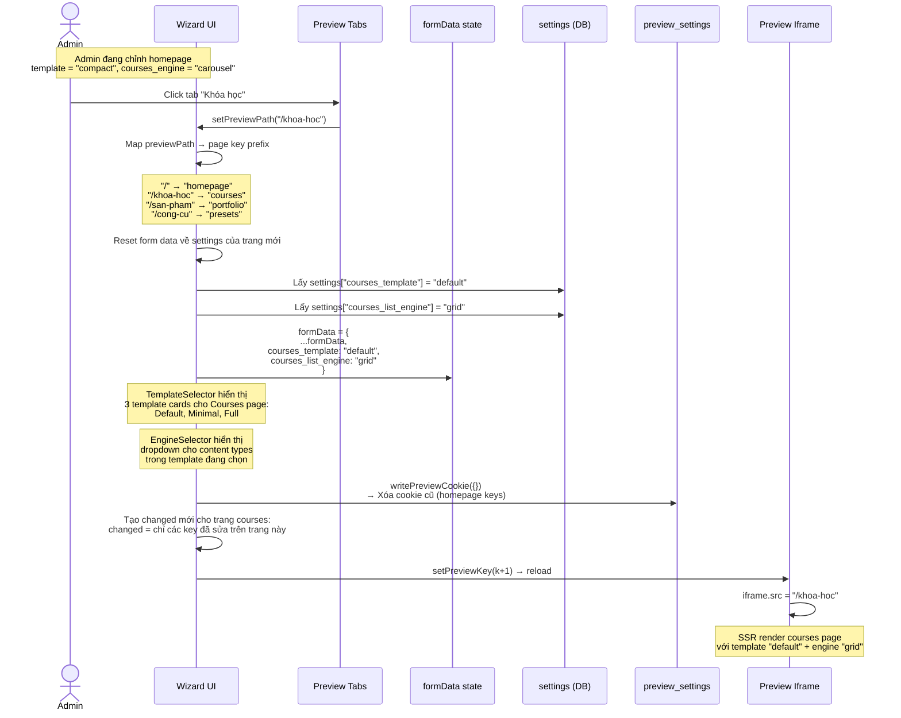
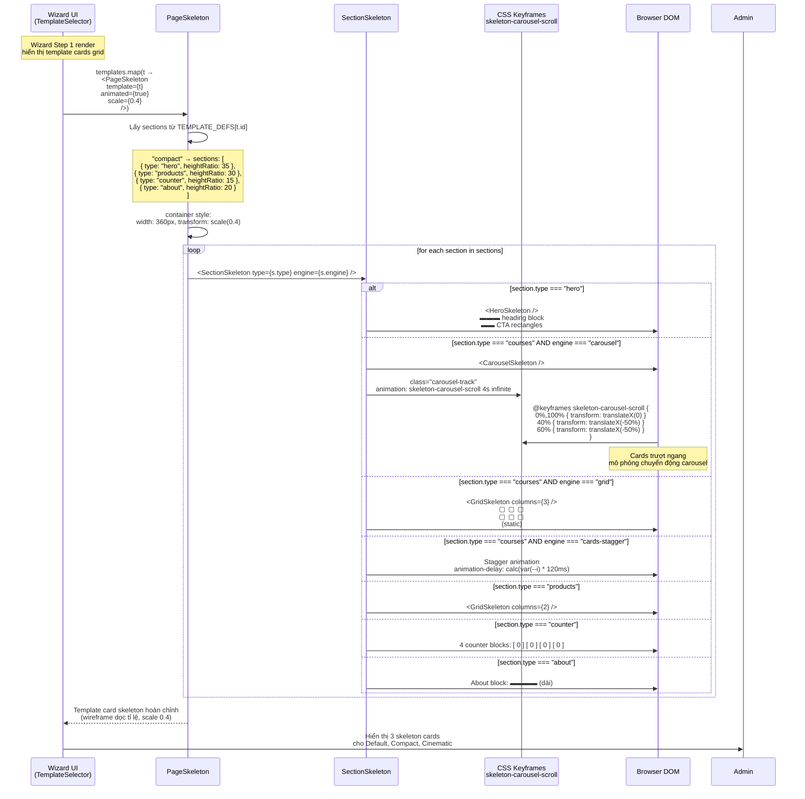
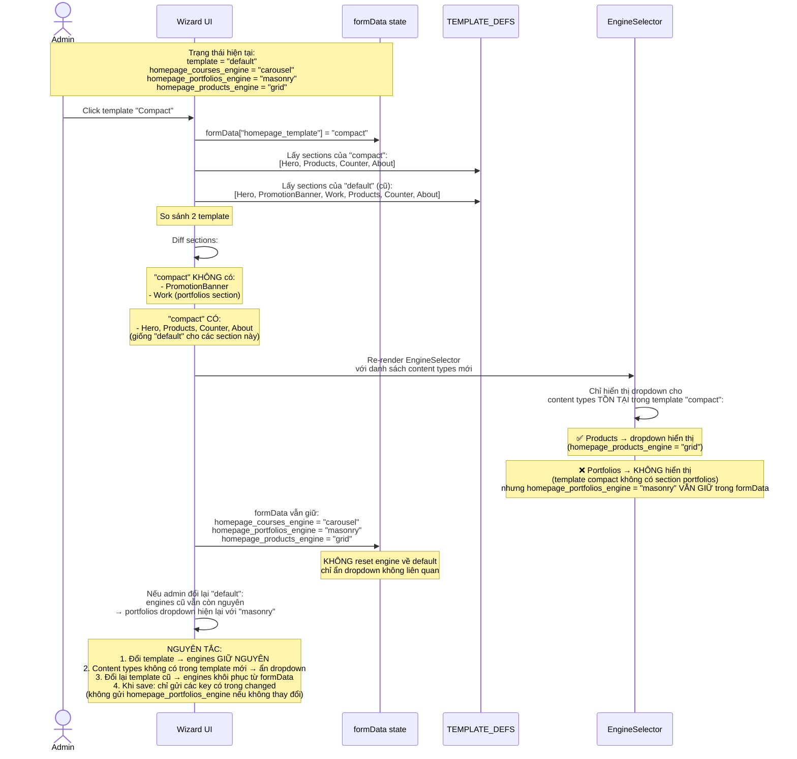

# 03 — Flows & Sequences: Multi-Layout Design System

**Date:** 09/08/2026
**Version:** 1.0
**Reference:** `spec-design-multi-layout-system.md`

---

Tài liệu này mô tả chi tiết tất cả các luồng dữ liệu (data flows) và trình tự tương tác (sequences) trong hệ thống Multi-Layout Design. Mỗi luồng được thể hiện bằng Mermaid `sequenceDiagram`, kèm giải thích ngắn gọn.

---

## Flow 1: Admin chọn Template (Wizard Step 1)

```mermaid
sequenceDiagram
    actor Admin
    participant WizardUI as Wizard UI<br/>(TemplateSelector)
    participant Cookie as document.cookie<br/>preview_settings
    participant Iframe as Preview Iframe<br/>(src={previewPath})
    participant PageTSX as page.tsx<br/>(SSR)
    participant SettingsLib as lib/settings.ts<br/>getSiteSettings()
    participant API as /api/settings<br/>(public GET)
    participant DB as site_settings<br/>(PostgreSQL)

    Note over Admin,WizardUI: Admin vào /quan-tri-vien/cai-dat → tab "Giao diện"

    WizardUI->>API: GET /api/settings
    API->>DB: SELECT * FROM site_settings
    DB-->>API: [{ key, value }, ...]
    API-->>WizardUI: [{ homepage_template: "default", ... }]
    WizardUI->>WizardUI: Hiển thị skeleton cards grid<br/>(Default, Compact, Cinematic)

    Admin->>WizardUI: Click template card "Compact"
    WizardUI->>WizardUI: Active state: border accent + checkmark<br/>formData["homepage_template"] = "compact"
    WizardUI->>WizardUI: handleChange("homepage_template", "compact")

    Note over WizardUI: Tính toán changedKeys:<br/>filter formData[k] !== settings[k]

    WizardUI->>Cookie: writePreviewCookie(changed)<br/>document.cookie = "preview_settings={...};path=/;max-age=600"
    Note over Cookie: Cookie stored on browser<br/>path=/ nên iframe đọc được

    WizardUI->>WizardUI: debounce 500ms
    WizardUI->>WizardUI: setPreviewKey(k => k + 1)
    WizardUI->>Iframe: key thay đổi → React remount iframe
    Iframe->>Iframe: iframe.src = "/" (reload)

    Note over Iframe,SettingsLib: SSR bắt đầu cho request GET /

    Iframe->>PageTSX: page.tsx render Homepage
    PageTSX->>SettingsLib: getSiteSettings()
    SettingsLib->>API: fetch("/api/settings", { revalidate: 60 })
    API->>DB: SELECT * FROM site_settings
    DB-->>API: [{ homepage_template: "default", ... }]
    DB-->>API: [{ key, value }, ...]
    API-->>SettingsLib: settings map

    SettingsLib->>Cookie: cookies().get("preview_settings")?.value
    Cookie-->>SettingsLib: `{ "homepage_template": "compact" }`
    SettingsLib->>SettingsLib: applyPreviewSettings(dbSettings, cookie)<br/>return { ...dbSettings, ...overrides }

    SettingsLib-->>PageTSX: { homepage_template: "compact", ... }
    PageTSX->>PageTSX: templateId = "compact"<br/>Template = TEMPLATES["compact"]
    PageTSX->>PageTSX: render <HomepageCompact engines={...} />
    PageTSX-->>Iframe: HTML response với layout compact

    Admin->>Iframe: Nhìn thấy layout mới (không có Work & PromotionBanner)
```

**Giải thích:** Khi Admin click template card, `handleChange()` gọi `writePreviewCookie()` ghi cookie `preview_settings` chứa các key đã thay đổi (so với DB). Sau debounce 500ms, iframe được remount bằng cách tăng `previewKey`. SSR bên trong iframe gọi `getSiteSettings()` → fetch settings từ DB → merge với cookie preview → trả về settings đã bao gồm template override → `page.tsx` resolve template tương ứng để render. Cơ chế này cho phép preview thời gian thực mà không cần lưu DB.

---

## Flow 2: Admin chọn Engine (Wizard Step 2)



**Giải thích:** Step 2 cho phép Admin chọn engine cho từng content type. Wizard chỉ hiện dropdown của các content types thực sự tồn tại trong template đang chọn (ví dụ template "compact" không có section "Work" thì không có dropdown cho portfolios). Cookie `preview_settings` luôn chứa toàn bộ các key đã thay đổi (bao gồm cả template từ step 1), không chỉ key vừa đổi. `writePreviewCookie()` nhận `changed` = tất cả các key có `formData[k] !== settings[k]` (xem `cai-dat/page.tsx:101-104`).

---

## Flow 3: Admin Lưu (Wizard Step 3)

```mermaid
sequenceDiagram
    actor Admin
    participant WizardUI as Wizard UI<br/>(StepActions)
    participant API as PUT /api/settings/batch
    participant Middleware as Auth Middleware
    participant Route as settingsRoutes<br/>batchUpdate()
    participant DB as site_settings<br/>(UPSERT)
    participant Cookie as document.cookie

    Admin->>WizardUI: Bấm "Lưu thay đổi"
    WizardUI->>WizardUI: handleSave()

    Note over WizardUI: Collect ALL changed keys:<br/>changedKeys = formData keys<br/>where formData[k] !== settings[k]

    WizardUI->>WizardUI: changed = {<br/>  homepage_template: "compact",<br/>  homepage_courses_engine: "carousel",<br/>  homepage_portfolios_engine: "masonry",<br/>  homepage_products_engine: "grid"<br/>}

    WizardUI->>API: PUT /api/settings/batch<br/>Authorization: Bearer {adminToken}<br/>Body: changed object

    API->>Middleware: Kiểm tra JWT token
    Middleware->>Middleware: Token valid? Role = ADMIN?
    Middleware-->>API: OK, userId = "settings-admin-id"

    API->>Route: batchUpdate(changed)
    Route->>Route: Validate: body is object,<br/>not empty, all values are strings

    loop for each [key, value] in changed
        Route->>DB: INSERT INTO site_settings (key, value)<br/>ON CONFLICT (key) DO UPDATE SET value = ...
        DB-->>Route: OK
    end

    Route-->>API: { updated: 4, keys: ["homepage_template", ...] }
    API-->>WizardUI: 200 OK { updated: 4, keys: [...] }

    WizardUI->>WizardUI: setSettings({ ...formData })<br/>(đồng bộ settings local với DB)

    WizardUI->>Cookie: writePreviewCookie({})<br/>→ document.cookie = "preview_settings=;path=/;max-age=0"
    Note over Cookie: XÓA cookie preview<br/>(vì đã lưu vào DB, không cần override nữa)

    WizardUI->>WizardUI: setPreviewKey(k => k + 1)<br/>→ iframe reload với settings từ DB
    WizardUI->>WizardUI: setSuccess("Đã lưu 4 thay đổi")
    WizardUI-->>Admin: Toast "Đã lưu 4 thay đổi" (auto-dismiss 3s)
```

**Giải thích:** Khi lưu, `handleSave()` gom tất cả các key có sự khác biệt giữa `formData` và `settings` (DB gốc), gửi một request `PUT /api/settings/batch` duy nhất. Phía API thực hiện UPSERT từng key (INSERT OR UPDATE). Sau khi lưu thành công, cookie preview bị xóa (`max-age=0`) để production SSR không còn bị override bởi preview nữa. iframe reload lại, lần này chỉ đọc từ DB. Phản hồi cho admin là toast "Đã lưu N thay đổi" tự biến mất sau 3 giây.

> **Code reference:** `cai-dat/page.tsx:117-142`, `settings.test.ts:91-127`

---

## Flow 4: Visitor xem trang (Production SSR)



**Giải thích:** Visitor production không có cookie `preview_settings`, nên `getSiteSettings()` trả về dữ liệu thuần từ DB. API `/api/settings` được cache với `revalidate: 60` (ISR — Incremental Static Regeneration), nghĩa là trong vòng 60s, các request đồng thời dùng chung cache, giảm tải DB. React `cache()` đảm bảo trong cùng một request, chỉ gọi `fetchSettings()` một lần. `page.tsx` dùng settings để resolve template và engines, render ra HTML hoàn chỉnh gửi về browser.

> **Code reference:** `lib/settings.ts:43-62`, `(nguoi-dung)/page.tsx:78-104`

---

## Flow 5: Admin đổi trang (switch page trong wizard)



**Giải thích:** Khi admin chuyển trang trong preview tabs, wizard reset về settings của trang đó. Mỗi trang có prefix riêng (homepage, courses, portfolio, presets). Cookie preview cũ bị xóa, và UI wizard (template selector, engine selector) tải lại tương ứng với danh sách template/engine của trang mới. Cơ chế này đảm bảo admin có thể chỉnh sửa nhiều trang liên tiếp mà không bị lẫn lộn settings.

> **Code reference:** `cai-dat/page.tsx:31-37,68` — `PREVIEW_PAGES` và `previewPath` state

---

## Flow 6: Engine Resolution (khi render section)

```mermaid
sequenceDiagram
    participant Template as Template Component<br/>(homepage-compact.tsx)
    participant Section as ProductSection<br/>(components/sections/)
    participant EngineLib as lib/layout-engine.ts
    participant EngineReg as ENGINE_REGISTRY
    participant EngineComp as Engine Component<br/>(components/engines/courses/)

    Note over Template: props.engines = {<br/>  courses: "carousel",<br/>  portfolios: "masonry",<br/>  products: "grid"<br/>}

    Template->>Section: <ProductSection<br/>  engine={engines.products}<br/>  courses={courses}<br/>  products={products}<br/>/>

    Section->>Section: Nếu section hiển thị courses:<br/>engineId = props.engine || "grid"
    Note over Section: engineId = "carousel"

    Section->>EngineLib: resolveCourseEngine("carousel")

    EngineLib->>EngineReg: COURSE_ENGINES["carousel"]
    Note over EngineReg: const COURSE_ENGINES = {<br/>  grid: CoursesGrid,<br/>  list: CoursesList,<br/>  carousel: CoursesCarousel,<br/>  "hero-grid": CoursesHeroGrid,<br/>  "cards-stagger": CoursesStagger,<br/>  masonry: CoursesMasonry,<br/>  compact: CoursesCompact<br/>} as const;

    EngineReg-->>EngineLib: CoursesCarousel

    EngineLib->>EngineLib: Fallback nếu id không tồn tại:<br/>return ENGINE_REGISTRY[id] ?? CoursesGrid

    EngineLib-->>Section: CoursesCarousel component

    Section->>EngineComp: <CoursesCarousel<br/>  items={courses}<br/>  settings={settings}<br/>/>

    EngineComp->>EngineComp: Render carousel HTML/CSS:<br/>&lt;div class="carousel-track"&gt;<br/>  &lt;CourseCard /&gt; × N<br/>&lt;/div&gt;<br/>CSS: scroll-snap-type: x mandatory

    EngineComp-->>Section: Carousel markup
    Section-->>Template: Section rendered với carousel
```

**Giải thích:** Mỗi template component nhận `engines` object từ `page.tsx`. Khi render một section (ví dụ ProductSection), section đó lấy engine ID từ props và gọi hàm resolver tương ứng (`resolveCourseEngine`, `resolvePortfolioEngine`, `resolveProductEngine`). Resolver tra cứu trong `ENGINE_REGISTRY` — một object map từ ID string sang React component. Nếu ID không tồn tại, fallback về engine mặc định (ví dụ `CoursesGrid`). Engine component sau đó render markup HTML/CSS tương ứng (carousel scroll-snap, grid layout, masonry...).

> **Code reference:** `spec-design-multi-layout-system.md:452-499`

---

## Flow 7: Skeleton Preview Animation



**Giải thích:** Mỗi template card trong Step 1 là một `PageSkeleton` được scale 0.4, hiển thị wireframe dọc tỉ lệ của toàn bộ sections trong template đó. `SectionSkeleton` quyết định render gì dựa trên `type` và `engine` — ví dụ engine "carousel" dùng CSS `@keyframes skeleton-carousel-scroll` để mô phỏng chuyển động trượt ngang, engine "cards-stagger" dùng `animation-delay` cascade. Các skeleton này giúp admin hình dung được bố cục tổng thể và chuyển động của từng template trước khi chọn.

> **Code reference:** `spec-design-multi-layout-system.md:233-313`

---

## Flow 8: Đổi template → engine reset hay giữ?



**Giải thích:** Khi admin đổi template, engine settings được bảo toàn trong `formData`. Các content types không tồn tại trong template mới sẽ bị ẩn khỏi EngineSelector (nhưng giá trị engine vẫn tồn tại trong state). Điều này cho phép admin thử nghiệm template khác nhau mà không lo mất cấu hình engine. Khi lưu, chỉ các key có thay đổi so với DB mới được gửi lên API. Nếu admin quay về template cũ, tất cả engine settings đã chọn trước đó vẫn còn nguyên.

---

## Tổng kết các flow

| # | Flow | Trigger | Key Mechanism | File Reference |
|---|------|---------|---------------|----------------|
| 1 | Chọn Template | Click template card | Cookie → iframe reload → SSR merge | `cai-dat/page.tsx:97-113` |
| 2 | Chọn Engine | Dropdown select | Cookie chứa all changed keys | `cai-dat/page.tsx:101-104` |
| 3 | Lưu thay đổi | Click "Lưu" | PUT /api/settings/batch → clear cookie | `cai-dat/page.tsx:117-142` |
| 4 | Visitor xem trang | HTTP GET / | SSR → getSiteSettings() → DB only | `lib/settings.ts:43-62` |
| 5 | Đổi trang preview | Click preview tab | Reset formData về page prefix | `cai-dat/page.tsx:31-37` |
| 6 | Engine Resolution | Template render section | ENGINE_REGISTRY lookup | `spec...md:452-499` |
| 7 | Skeleton Preview | Step 1 render cards | CSS keyframes per engine type | `spec...md:233-313` |
| 8 | Template → engine | Đổi template card | Hide unrelated dropdowns, keep values | Logic described above |

---

## Cookie Lifecycle

```
┌─────────────────────────────────────────────────────────────────┐
│                     COOKIE preview_settings                     │
│                                                                 │
│  CREATED: khi admin thay đổi bất kỳ field nào                   │
│           writePreviewCookie(changed)                           │
│           document.cookie = "preview_settings=...;max-age=600"  │
│                                                                 │
│  UPDATED: mỗi lần handleChange() → writePreviewCookie(changed)  │
│           Cookie chứa TẤT CẢ các key đã thay đổi               │
│                                                                 │
│  CONSUMED: SSR getSiteSettings() → cookies().get("preview_...") │
│            merge { ...dbSettings, ...previewOverrides }         │
│                                                                 │
│  DELETED: 1. Khi admin bấm "Lưu" → writePreviewCookie({})      │
│              → max-age=0 (xóa cookie)                           │
│           2. Khi admin đổi tab preview → xóa cookie cũ          │
│           3. Tự động hết hạn sau 600s (10 phút)                 │
└─────────────────────────────────────────────────────────────────┘
```

> **Code reference:** `cai-dat/page.tsx:39-58`, `lib/settings.ts:27-41`

---

## Related Documents

- `01-architecture-overview.md` — Tổng quan kiến trúc
- `02-data-model.md` — Settings data model & keys
- `spec-design-multi-layout-system.md` — Spec gốc (Section 4: Settings Data Model, Section 5: Admin UX, Section 9: Preview Cookie)
